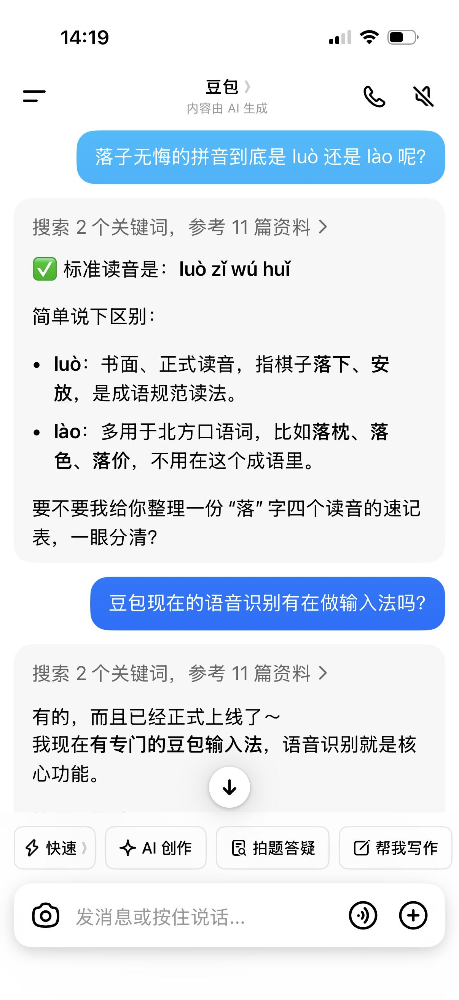

今天注意到了一款 AI 时代新出现的需求孕育的新产品：“Vibe Island”，稍加调研了一下它的产品功能与商业模式，顿时感觉在 AI 时代产品护城河已经与之前的古法编程时代大不相同了，我们的思维也得做顺应时代的范式改变。

## Vibe Island：做定义品类的产品

Vibe Island 是一款 macOS 的应用，主要是把 Macbook 的刘海（notch）变成 AI agent 的实时控制台，可以监控、授权、跳转，不用再切换到编辑器去做。

功能上，它支持市面上所有主流的 AI 编程工具，可以同时在 notch 里跑多个 agent，可以简单的在 notch 面板里按 Allow / Deny 按钮和工具交互，可以精准跳转到对应 terminal、tmux 窗口等等。总之就是一个非常好用的，针对 AI agent 工具的工作监控面板。定价上，Vibe Island 采用 $19.99 买断制，有免费试用版。

但是自从 Vibe Island 一出，就有争先恐后的很多“开源替代”冒出来，Claude Island、CodeIsland、Notchi 等等，都在 Vibe Island 的概念上，或做一模一样的免费产品，或稍加改动，但总体还是同一个 idea 的产品，用的也是类似的技术。

很明显，这类工具的技术护城河（hook机制、Unix socket通信、SwiftUI notch overlay），在之前需要资深程序员花一两个月稍加学习，才能做一个类似的应用出来，但是在 AI 时代，仅仅是几个小时，烧掉几十几百 M 的 token 就能复刻出来的产品。现在技术本身已经不再能当做护城河了，之后如果我们要做产品，要借助产品赚钱，需要找到在 AI 冲击下不会失效的护城河。

观察 Vibe Island 和它的“开源替代”们的差异，我认为 Vibe Island 的成功主要有以下三点：先发优势与执行质量，以及分发能力

### 先发优势：做该品类的第一个产品

先发优势不仅仅是“先把这个产品做出来”这么简单，先发优势更重要的是“比别人提前观察到这个需求”的重要能力。当它是这个品类的第一个产品时，它本质上是先完成了“品类定义”，开辟了新的赛道。

就算 Vibe Island 之后有无数的开源替代品涌现出来，当用户心理想到“notch AI面板”，第一个冒出来的就是 Vibe Island。若是能做到这一点，就会给 Vibe Island 带来无穷无尽的长尾效应，让这个产品能持续赚钱，生生不息。

### 执行质量：做好用，而不只是能用的产品

执行质量是先发优势的放大器。如果先发优势端出来的是一个不好用的产品，那很容易就在前期就被更好用的替代品给挤占了生态位。

在 AI 时代，谁都能轻轻松松搓出来一个 60 分的产品，但是大家对产品的要求也因此提高了。如果我直接端出来的是一个 90 分的替代品，用户们肯定也纷纷转向这个更好用的替代品。

Vibe Island 就是在细节打磨上划了很多功夫，比如动画流畅度、边缘 case 处理、更新节奏，还有直接下载双击即可使用的安装体验，都比那些甚至还需要自己 build 的开源替代要好用精致太多了，这就可以保证很多用户的黏性。虽然是买断制的，但是用户会持续使用，会推荐给其他人，会不断有新用户涌入。

### 分发能力：能卖出去的才是好产品

分发能力是很多做技术的人意识不到的一个重要护城河，就像做技术的看不起做销售的，认为“酒香不怕巷子深”，只要产品做的够好，自然有人来用。

但是要发挥出先发优势与执行质量的优势，宣发、营销、传播是必不可少的。很多开源项目仅仅是写了，然后就摆在那里，等人发现，但是 Vibe Island 在 Product Hunt 上跻身榜一，在 Youtube 上被 Influencer 做视频演示，在 Hacker News 上霸榜一天，这种流量本身就可以作为很强的产品护城河。同时低价买断 + 试用，也促成了病毒式的传播。

在分发上的能力真的是很多人意识不到的巨大差距，而分发结合先发优势、执行质量，就能一起铸就很深的产品护城河。

## Typeless：成也质量，败也质量

Typeless 是前些日子很火的语音输入法，相信读者多少都听说过，在此我就简单介绍。

它主要创新点在于，在普通的语音转写文字（STT）之后，加一层大模型润色，消除掉说话的语气词、将内容整理的更符合当前场景，可以做到让用户语音输入完，直接可以按下发送键而不用回去编辑修改。

Typeless 成功做到了“品类定义”，它很创新的用 Macbook 上的 fn 键作为语音转写的触发键，按一下开始录音，再按一下结束，随后后天进行转写、润色，再自动输入到光标处。它不仅定义了“语音输入法”这个品类，后来者都是类似的转写+润色的形式，还重新定义了 fn 键，如今各个软件都在试图占有比如 capslock，option，command 等等单键的快捷键触发，而不是从十几年就开始的复杂组合键触发。

关于执行质量方面，我其实认为它已经是一个 90 分的产品了。因为 Typeless 定价是 $12/mo 订阅制的，我感觉确实略贵，于是也尝试过其他几个开源竞品，甚至自己一下午 vibe 了一个出来。但是它在场景识别（比如是 IM 还是邮件还是 coding，用不同语气润色），中英（甚至日语）多语种混合输入转写都明显是下了很多功夫的，不是轻轻松松就能复刻的。

### 长期维护：花钱买的是不折腾

而开源项目就算在功能上做到了 Typeless 等同的水平（说实话是有几个体验甚至能超过 Typeless 的），也没能把我从 Typeless 里翘走，这主要是因为我认为 Typeless 还有一个护城河：长期维护的保障。

Typeless 作为一家备受瞩目、融到钱的商业公司的项目，它肯定相比于其他管生不管养的开源项目，能提供更多的长期支持。比如我无需操心什么时候出了一个更好用的 STT 模型，无需为优化润色速度而烦恼，我只要不断给 Typeless 付钱，他们的人会帮我处理好这些的。

而如果我使用开源项目，可能省钱了，但是并不省心。语音输入法本身作为一个提效的工具，如果我还要花很多时间在维护工具上，那就本末倒置了。

## 豆包输入法：大厂的降维打击

但是我最后还是选择了豆包输入法。

这事说来也巧，我本来是不知道有这个产品的存在的。但我天天用着豆包app，作为我的闲聊小助手。豆包的语音输入做的和微信一样，长按输入，松手就发出去，自动转写为文字发给豆包处理。

我那天给豆包的问题是：“落子无悔的“落”到底读 luò 还是读 lào 呢”，当时我说完就在想，这似乎不该发语音的，这多半 STT 识别不出来吧。但是豆包居然能准确无误的识别出并标注好拼音了。

我随即就意识到，这么准这么厉害的语音转写，还有长按输入松手就发的这么舒服的 UX，豆包团队要是把这个功能独立拆出来做一个语音输入该多好。

我立刻就问了豆包，她说有，我立刻就去下载使用了。

### 更高的执行质量

之所以一直在物色其他输入法，主要还是 Typeless 在手机端的 UX 实在做的不怎么行，键盘上就是一个巨大的按钮，点一下开始输入，再点一下结束。这固然很简单，但是我还是偶尔需要修改输入的内容，或者偶尔就是要纯手打一些短回复，此时就得麻烦地切换输入法。

而豆包输入法仅仅是将“长按空格”作为语音输入的交互，其他部分还是正常的中文拼音输入法，能让我想打字的时候可以正常打字，想语音的时候直接长按空格就可以，非常的无感。

这就是大厂对小厂的碾压的体现了，Typeless 小公司很难做到“开发一个中文输入法”，更何况他们的主战场还是非中文用户。但是豆包背靠字节跳动，无论是组个团队开发中文输入，甚至是直接买一个输入法团队，都是轻轻松松的事。

豆包输入法还做了一个我认为是比 Typeless 要好的地方，它做了流式输出。也就是在听写的过程中文字就会不断地在屏幕上跳出来，而大模型润色则会直接在之前已经输出的文字上进行修改。这虽然是一个小改变，但我认为这是 UX 的一大步。

### 大厂的从容

诚实地讲，仅仅是“语音输入法”这一个维度上，豆包输入法是不如 Typeless的，可能大约是 80 分与 90 分的差距。听写准确度略差，润色效果也略差。

但豆包输入法的其他几个长板，正好插在了 Typeless 上最影响我体验的几个短板上，在“执行质量”上胜过了 Typeless。这就成功撬动了我，最终在手机上选择了豆包输入法而非 Typeless。

说的有点多，总结一下优点：

1. 额外带一个正常的键盘输入法，解决切键盘痛点
2. 流式输出，更符合心理的小长板
3. 背靠豆包App的流量入口，天然分发优势
4. 免费

差点漏了，决定性的一点，豆包输入法是免费的，一个月省了 $12 也就是差不多 85 块钱了！这是还要愁生计的小作坊根本无法办到的事，只有字节跳动这种财大气粗的大厂才能端出这样一个又好用又免费的产品给大家使用吧。

## Cursor：选择比努力更重要

Cursor 也不必多说，想必大家多少都听过，是个非常成功的 AI coding IDE。Cursor 重新定义了 Tab 键，甚至可以说开创了 AI coding 的时代。

但是最近，Claude code、Codex 这种大厂软件，带着 OpenCode、Kilo Code 等开源软件，正在狠狠地蚕食 Cursor 的市场。

Cursor 几乎做对了前面我们总结的每个方向，有先发优势、有执行质量、有高质量营销、有长期维护，但是最终还是逐渐在丢掉自己的市场。

Cursor 基本上是把自己“AI coding IDE”的品类代名词，在 Github Copilot 的肩膀上，将产品做到了90分甚至95分。在 AI 辅助 coding 的时代大获成功。

### 范式打击

但是 Claude code 等产品出现与火爆，代表的是一种新范式：“vibe coding”。AI 不再只是辅助程序员进行 coding，而发挥本身的主观能动性（agentic），直接从头到尾完成 coding 任务。

一个能让用户不再需要打开 IDE，甚至不需要知道 how to code 就能完成 coding 工作的工具，远远超过了 “辅助 IDE” 这一层面，是对 Cursor 的一种范式打击。

这事一种比技术复制更难防守的打击，不是对手和你做了一样的东西，比你做的更好，而是对手直接重新定义了这件事应该怎么做。

## FSD：硬核技术仍然是护城河

讨论了这么多，似乎感觉技术已经不重要了，但是此时笔者脑子里又冒出了一个非常有技术护城河的产品来 ———— Tesla FSD。

笔者是到了洛杉矶才开始大量开车的，FSD 是在美国市场里唯一一款让我觉得“比我开得好”的智驾。笔者还没尝试过国内几个新势力的智驾竞品如何，暂时不做讨论。

在美国这里，FSD 可以说是唯一的智能驾驶了，虽然也有 Waymo、奔驰L3 的存在，但笔者认为采用高精地图的智驾方案，根本算不上智能驾驶，本质上只是轨道车而已。

那为什么其他厂商不做呢，智能驾驶这个小产品为什么不抄一下来，放到自己车上呢？

我认为的答案是，支撑 FSD 这种产品的技术，是不可快速复制的技术。FSD 的护城河不是“智驾算法”，而是数不胜数的 Tesla，在数十亿 mile 里采集来的真实驾驶数据的飞轮，这是简单的烧 token 根本买不来做不到的东西。

以“数据积累”，“数据采集”作为技术壁垒，在 AI 仍然采用概率模型范式（在很长一段时间内肯定不会改变）的时代，AI 反而会加速它的优势积累。而如果技术壁垒仅仅是“代码复杂度”，那 AI 时代它仅仅是几个小时、几百美金的问题。

## 结语

回顾这几个案例，我们其实可以拼出一张 AI 时代护城河的优先级地图。

技术复杂度已经出局了。先发优势、执行质量和分发能力，是大多数独立产品能触及的天花板，但它们是相对护城河，遇到有资源的大厂可以被执行质量碾压，遇到范式转移可以被直接绕过。而像 FSD 这样以数据飞轮为核心的技术壁垒，才是在 AI 时代真正加速积累、而非加速消亡的护城河。

所以如果非要给一个排序的话，大概是这样的：

不可复制的数据/规模飞轮 > 范式定义能力 > 先发 × 执行 × 分发 > 技术复杂度（已失效）

当然，绝大多数人和团队一开始是没有资格谈"范式定义"和"数据飞轮"的。能做好先发、执行和分发，在 AI 时代已经足以养活一个不小的生意了。

只是要清醒地知道，我们在做的是一场速度游戏，而不是一场壁垒游戏。速度游戏可以赚钱，但不要误以为自己拥有了护城河。