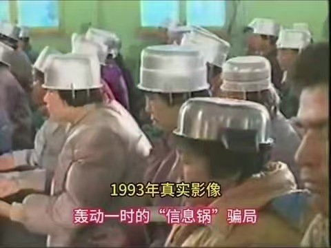
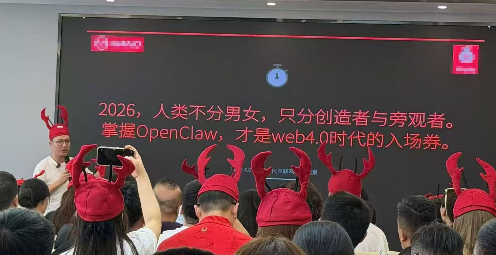

最近 OpenClaw 在 Github 上的 star 数，成功打败了 linux 和 React，登上了 Github 的榜一。借此机会，想聊一聊关于 OpenClaw 的两种主流声音：一部分人觉得 OpenClaw 是 AGI 的初步形态，是 Web4.0，是 AI 革命的一次重要更新。另一部分人觉得 OpenClaw 狂欢是新一次的“气功热”，是大模型商家为了卖 token 做的局。

## 我与 OpenClaw

笔者曾经也是持有着后面的观点，在 Manus 名声鹊起时，我第一反应便是：“这不过就是把大模型的 Tool use 和 MCP 预装好，再给一个电脑，打包卖吗？就现在的 AI 的智能，真做一些稍有难度的事，不就歇菜了，还得是我给 AI 去擦屁股。”当时的我还对 AI Agent 产品满是不以为然，甚至带着几分技术人的傲慢，觉得这产品没有什么“真正的创新”。当然后面的事大家也知道了，Manus 做大做强，被 Meta 高价收购了，说明这个产品是被 Meta 的技术眼光所看好的。显然，当时我的不屑一顾，属实是鼠目寸光了。

后来还叫 Clawdbot 的 OpenClaw 火起来时，我出于好奇，也在我的闲置树莓派上部署了一个，开始了我的养虾生活。最让我惊喜的是这一个简单的交互形态，居然能涌现出超乎想象的功能性。

比如说我之前一直想做一个定制的信息推荐系统，来屏蔽掉消耗我精力的信息，只筛出我感兴趣的。用小龙虾就可以简单的几句交代它我想看什么，不想看什么，让它自主在互联网上搜索每天的新闻、新产品，再推送给我。这直接就打消了我本来想手搓一个的“多平台爬虫+作品打标签+协同矩阵”的工业化推荐算法。

同时，让他帮我看 USC 学生邮箱里每天各个部门的几十封广告，没用的直接标为已读。又或是从我的 Todo 数据库里取出待办事项，安排进 Calendar 里，解决我的执行力问题，每天就不用纠结“今天要做什么”，而是直接去做就可以了。

我让它做的这些事虽然结果都很“粗糙”，不是很稳定，不是很精准，但强就强在我只是简单的说几句，就实现了我理想效果的 80% 的效果，这就是我觉得 OpenClaw 给我最惊艳的地方，一个已经初步具有通用智能的 AI Agent。

我是认为 OpenClaw 其实是 Manus 的一个本地版，外加打通了 IM 通信让交互更加便捷和符合“小助理”的使用体验。我现在对于 OpenClaw 的看法，基本上可以套到 Manus 上。因此可以说我对这类产品有一个巨大的“没用、骗局”到“改变生活”的转变。我认为我得反思一下为什么我会有如此大的转变，之前是为什么会鼠目寸光。

## 类比陷阱

和 OpenClaw 交流了一下后，我意识到我是陷入了所谓的“类比陷阱”中。我们每个人似乎都有类似的本能：遇到陌生的新事物时，第一反应不是去了解它的核心价值，而是找一个熟悉的“旧参照物”去类比，以此来获得安全感和掌控感。这种本能，本质上是大脑为了降低认知成本，做出的“偷懒”选择————用已知来解释未知，远比从零开始理解一个新事物更轻松。

人们倾向于把 OpenClaw 批判为 “它能做的 Claude Code 都能做”，不过是 Claude Code 套了个壳。或者 “不过是一个本地的 Manus”。我认为这些声音其实是正确的，他们能看透这个产品的技术本质，但是却没有看到这个产品提供的额外的可能性。

这样的例子，在人类历史反复上演：

- 汽车不就是不用马的马车吗？
- 电话不就是远距离电报吗？
- 互联网不就是电子报纸吗？
- 智能手机不就是手机+PDA吗？
- 电商不就是网上商场吗？
- 比特币不就是一串代码吗？
- 自动驾驶不就是高级定速巡航吗？
- 大模型不就是高级搜索引擎吗？

这些都是曾经广泛存在的认知，非常具有代表性的“类比陷阱”。但是我们现在知道了：

- 汽车成了现代工业最重要的基石之一，重构了城市、郊区形态，重构了物流，重构了战争，深刻影响着人类文明
- 电话大大改变了人类的远距离沟通效率，让长距离的远程协作变得可能，大大提高了人类社会的效率
- 互联网不必多说，直接引爆了一次科技革命，人类的现代生活方方面面都离不开互联网
- 智能手机不仅是通信工具，它还改变了人们的社交方式、注意力分配机制、时间利用方式，孵化了“流量”这一概念
- 电商不止改变了销售方式，更是库存模型、供应链、竞价模式的一次更新，是商业去地理化的大改革
- 比特币虽然确实是一串代码，但它代表着去中心化的信任，是对“国家货币权”的一次挑战
- 自动驾驶虽然仍在发展阶段，但相信在不久的将来它会重塑现在的交通体系，“驾驶”这一能力，将不再是人的必修课
- 大模型更不必多说，相信能看到这篇文章的你，自然有对它的深刻见解

人们倾向于用旧的范式，去压缩、理解新的范式。每一次范式跃迁，都会被解释成“不过是旧的东西加点料”，直到它重写规则，才会承认它从来不是叠加，而是替代。

## 科技三定律

这很像科幻作家道格拉斯·亚当斯说过的，人类对科技发展的“科技三定律”：

1. 任何在你出生时就已经存在的事物，都是正常的、平凡的，是世界运作的自然法则。
2. 任何在你15岁至35岁之间诞生的发明，都是新奇的、激动人心的、具有革命性的，你很可能可以在其中找到一份属于自己的职业。
3. 任何在你35岁之后发明的东西，都是违背自然规律的。

这三条定律看似调侃，实则戳中了人类面对新技术的认知惰性：出生时就存在的科技会被我们视为理所当然，15至35岁间出现的新技术易被我们接纳探索，而35岁后出现的则易因认知固化被否定，这也正是人们陷入类比陷阱、误判OpenClaw价值的核心原因————我们的大脑，似乎天生就带着“用已知解释未知”的出厂设置，以此来降低认知成本、规避未知风险，在快速迭代的时代里，往往会成为我们认知升级的绊脚石。它让我们停留在舒适区，用旧地图寻找新大陆，最终错失那些真正能带来改变的机会。

在这个科技迭代日新月异、新范式不断涌现的时代，我们更应挣脱认知惯性的桎梏，始终保持一颗15至35岁那般鲜活、开放、不设限的心。不困于过往经验，不怠于接纳新知，以好奇消解傲慢，以包容替代偏见，主动去理解、去尝试、去拥抱每一个可能带来变革的新事物，方能乘上时代的浪潮奋力前行，不被飞速发展的洪流所裹挟、所淘汰。

## 结语

写下这些，并不是想吹捧 OpenClaw 有多优秀，毕竟它也未必适合每一个人，就像当年的智能手机，也有人至今习惯使用功能机。我只是想借这个契机，分享一点自己的感悟。

认知惯性不可怕，可怕的是我们从未意识到它的存在，更可怕的是，我们愿意被它绑架，放弃对新事物的了解和尝试。当你对一个新事物的第一反应是“这不就是XX吗”的时候，不妨停一秒，静下心来问自己一句：我此刻的判断，是基于对它的深入了解，还是在用旧的认知，去定义一个全新的价值？我是不是因为害怕未知，才下意识地否定它的存在？

很多时候，我们对 AI Agent 的态度，大概就和当年父母看待智能手机的态度，有着异曲同工之处。我们嘲笑父母跟不上时代，却没发现，自己也正在变成那个“固执己见”的人。打破认知惯性，从来不是强迫自己接纳所有新事物，而是学会给自己一点时间，放下偏见和傲慢，去看见新事物背后的价值——哪怕它和我们过往的经验，截然不同。