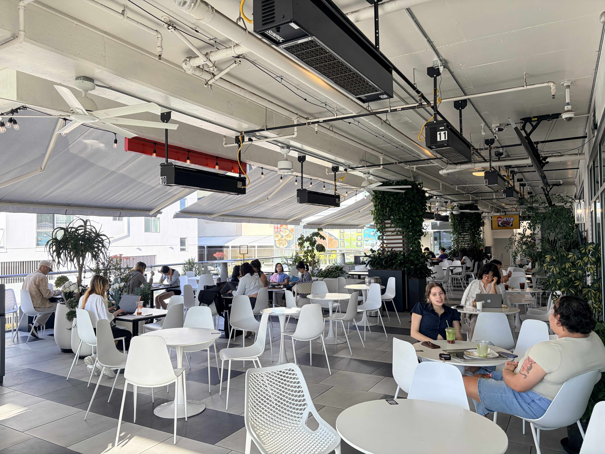
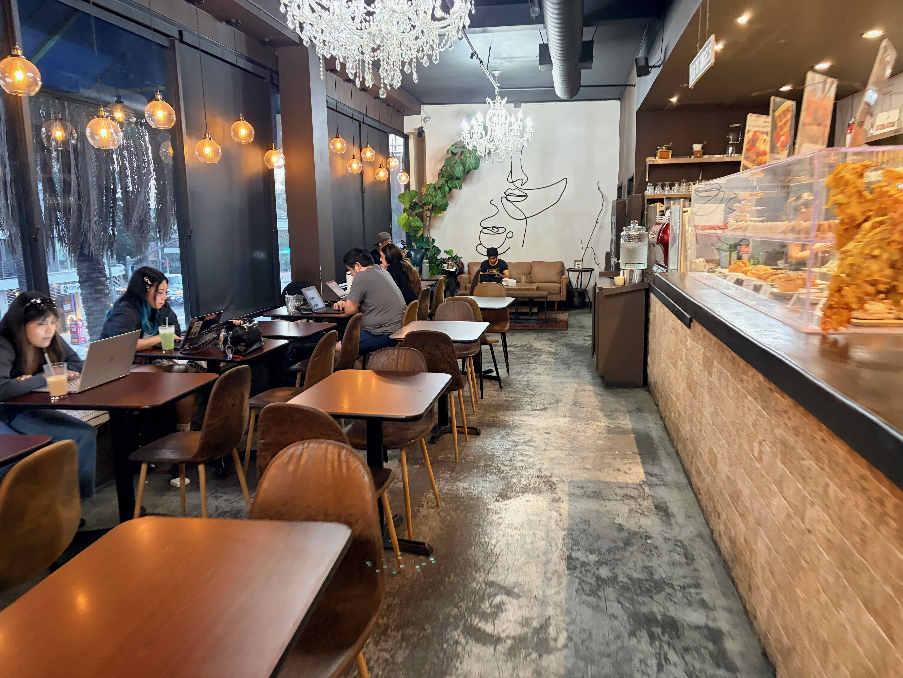
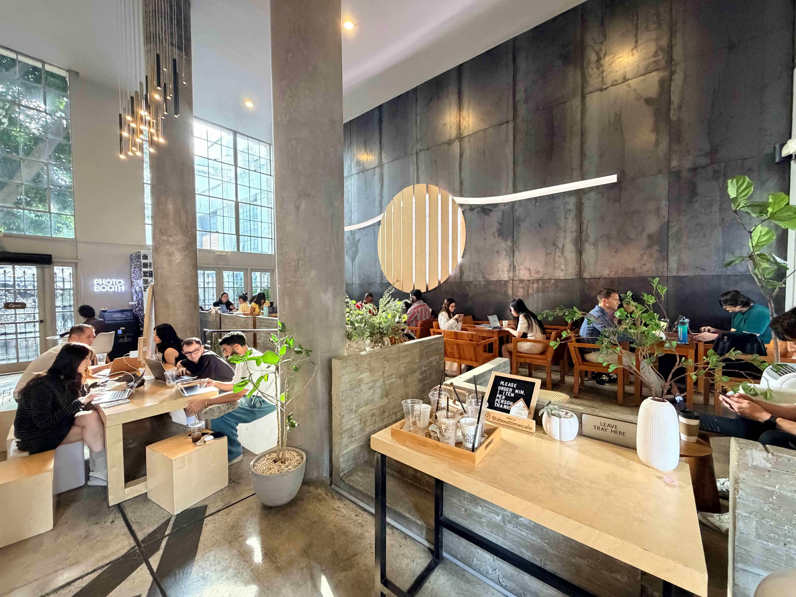
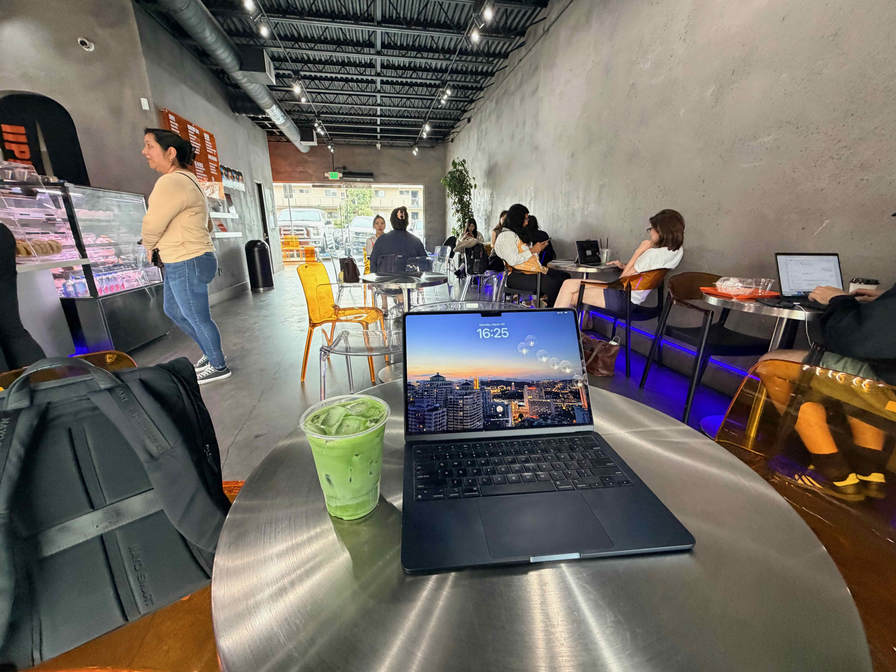
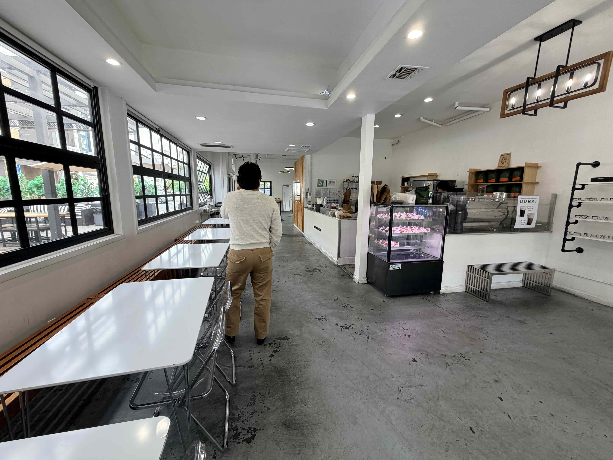
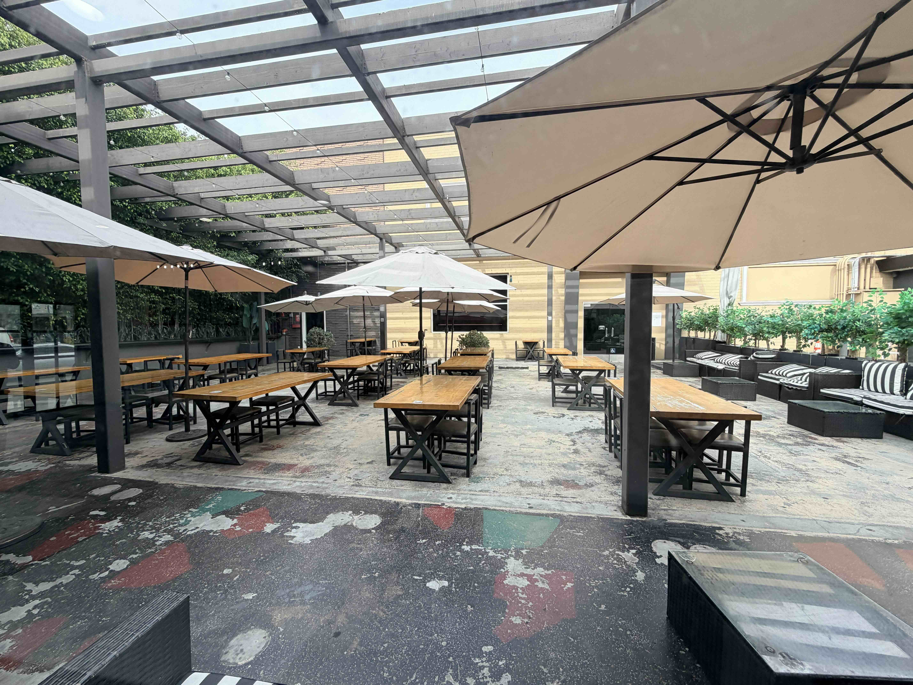

## Mi Cafe

Wi-Fi ✔ 插座 ✔ 厕所 ✔ 户外 ✔ 停车 ✔ 氛围 ✔ 安静 ✘

在 LA 去的第一家，感谢 Justin 友友带我探店。值得单独说的是有一个鸡肉馅饼（不知道算不算馅饼）“3 Cheese Chicken Quesadilla” 挺好吃的，值得一试。

感觉学习氛围很浓，有很多韩裔帅哥美女在那认真学习，但店里音乐我一直觉得有点大，影响状态。户外区域体验就好很多，还可以上三楼就安静了。不过户外有时阳光台闪眼睛了，我也不太适应。总体来说是一个不会错的保底选项。

## Awesome Coffee

Wi-Fi ✔ 插座 ✔ 厕所 ✔ 户外 ✘ 停车 ✔ 氛围 ✔ 安静 ✔

跟着小红书集美找到的一家，装修比较老旧，但给我感觉是古色古香的，正合适！Plaza 内车位容易满，但后面其实还有额外车位可以去看看。小小的一家咖啡厅，但基本上每个桌都有插座，且店里安安静静的学习氛围超好。适合在比较浮躁的时候去，让心静下来专注学习。

## About Time

Wi-Fi ✔ 插座 ✔ 厕所 ✔ 户外 ✔ 停车 ✔ 氛围 ✔ 安静 ✔

感觉是目前最喜欢的一家！非常温馨的一个装修，让人暖暖的。学习氛围也很好，大家都在努力学习刻苦工作。而且我第一次尝试 Matcha Einspanner（其实也就是抹茶拿铁+奶盖），感觉挺惊艳的！大桌子只有几张，去得晚就得在单人小桌子了，有点施展不开。电也是比较稀少，网偶尔也不稳定。但是装修实在是太加分了，仍然推荐！

## CAFE UPPER

Wi-Fi ✔ 插座 ✘ 厕所 ✔ 户外 ✘ 停车 ✔ 氛围 ✘ 安静 ✘

感觉不是很喜欢的一家，虽然 B&O A9 音响的效果真的很好，但是吵吵闹闹的。而且装修比较偏向金属、工业风，不是很能让人静下来学习的感觉，不是很推荐。

## MemoryLook

Wi-Fi ✔ 插座 ✔ 厕所 ✔ 户外 ✔ 停车 ✔ 氛围 ✘ 安静 ✔

很巧的，就在 Mi Cafe 边上一个街区。氛围说不上多好，就是很多的桌子和椅子。户外空间很大，很适合不冷不热的时候在户外吹吹风。室内插座基本上一桌一个，户外没有电，网有一点点小卡。总体来说算是平庸的一家店，胜在桌子充足。

 

## Village Well Books & Coffee

Wi-Fi ? 插座 ? 厕所 ? 户外 ✔ 停车 ✔ 氛围 ✔ 安静 ?

在 Culver City 的一家，是书店咖啡馆二合一。似乎听热门的，看着小红书推荐去的，但是去的时候完全没座，只能遗憾离场。粗看是挺不错的，有机会可以再去。

## cognoscenti coffee

Wi-Fi ✔ 插座 ✔ 厕所 ✔ 户外 ✔ 停车 ✘ 氛围 ✘ 安静 ✔

还是 Culver City，上面那家没座之后随便找的。特别小的一家店，里面可能就十来个座，户外只有两张桌子。而且试了 Coffee Latte 感觉并不好喝。总体来说不推荐。

> 符号备忘：
> 
> ✔ (U+2714) - `&#10004;`
> 
> ✘ (U+2718) - `&#10006;`