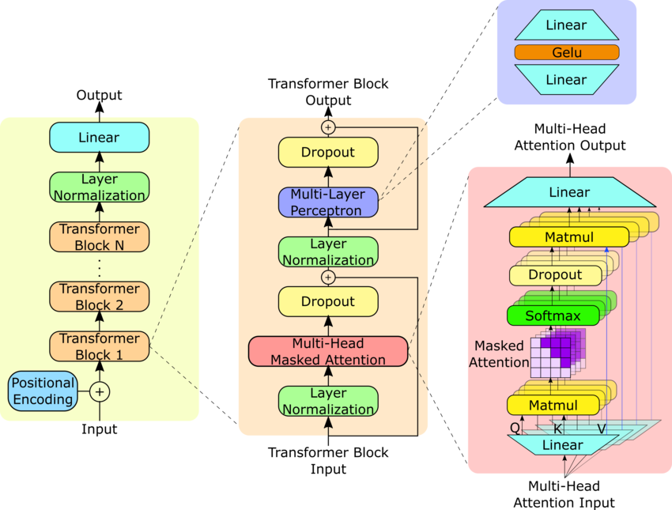

接着上一篇的 NanoGPT 博客内容，笔者继续学习了 不少模型推理的优化手段，会在接下来的几篇里逐一叙述。在上一篇《「从零开始学大模型」手搓GPT》中，我跟着 Andrej Karpathy 写了一个 NanoGPT，这一篇文章也将会是在这个 NanoGPT 的代码上实现优化。

## KV Cache

虽然 Transformer 模型本身（网络结构、权重）在推理阶段是不变的，但是在推理时，每次处理的数据是不一样的。

假设初始输入给模型的向量维度是 `[B, T]`，那它在完成一步推理后，会变成 `[B, T + 1]` 维度重新输入回模型进行推理，再变成 `[B, T + 2]` 维度，然后是 `[B, T + 3]` 维度......直到达到所需长度（主动停止或者被动截断）

> 注意到这里其实是可以有 Batch 这个维度的并行的。
> 
> 模型在训练的时候可以进行 Batch 维度的并行，在推理的时候其实也可以进行 Batch 维度的并行。它并不要求每一个长度为 T 的 1 维向量内容是一样的，只要不同长度的输入被 pad 到同样的长度 T 就可以并行。

在这个过程中，每一步推理是串行进行的，必须得等到第 `T+1` 个 token 生成之后，才能重新进行推理，预测第 `T+2` 个 token，以此类推。不过我们注意到，实际上在输入维度为 `[B, T+1]` 的时候，它对于前面的 `[B, :T]` 这些数据的计算，实际上和之前直接计算 `[B, T]` 的时候是完全一样的。如此一来，我们就能用上缓存的思想。既然它们再算一次的值是一样的，那不如直接缓存起来，不用再算一遍。

> - 为什么？
> 
> 假设第 `T+1` 个 token 是空的（0, nan），那么传入的 `[B, T+1]` Tensor 与 `[B, T]` Tensor 计算是完全一致的
>
> - `T+1` 个 token 不会影响前面 token 的 QKV 值吗？
> 
> 不会，因为有 Casual Mask，`T` 位置的 QKV 值只受 `[0:T]` 位置的 token 影响，不受 `T+1` 这个“未来 token”影响

<center></center>

更进一步地，我们再走一变推理流程，看一下有哪些结果需要缓存。在每一个 Attention Head 中：

1. `[B, T, C]` 已经计算完毕，全部结果都缓存好
2. 第 `T+1` 个 token: $t_{T+1}$ 输入注意力头，是一个 `[B, 1, C]` 维的 Tensor
3. $t_{T+1}$ 与 $W_Q, W_K, W_V$ 相乘，得到 $Q_{T+1}, K_{T+1}, V_{T+1}$，维度都为 `[B, 1, K]` （`K` 为模型的 $d_k$，“问题空间”维度）
4. $Q_{T+1}$ 与所有的 $K_{i}, (1 \leq i \leq T + 1)$ 相乘，计算 $W$ 矩阵，维度 `[B, 1, T+1]`
5. $W$ 除以 $\sqrt{d_k}$，乘以所有的 $V_{i}, (1 \leq i \leq T + 1)$，得到 Attention 值

$$ \text{Attention}(Q_{T+1}, K, V) = \text{softmax}(\frac{Q_{T+1}K^T}{\sqrt{d_k}})V $$

我们注意到，第 `T+1` 个 token 的 $Q_{T+1}$，会查询先前所有的 $K$，再根据 $QK$ 匹配程度加权乘以所有的 $V$。我们如果缓存了先前计算过的 $K$ 和 $V$ ，就可以省去很多的计算量了。 

这就是 **KV Cache** 的底层原理。

> 为什么只缓存 K 和 V，不用缓存 Q？
> 
> 从推理流程上理解：计算最新的 token，只需要计算最新的一个 attention 值，而这只需要最新 token 对应的 Q 与整个序列的 K 和 V 就够了。
>
> 从信息尺度上理解：我们只需要算最新 token 的输出，所以只需要最新 token 的 Q。老位置的输出在之前的 step 已经算完了，根本不需要再算，所以老 Q 自然没用了。

### Prefill 与 Decode

**Prefill** 阶段：

在真实使用场景中，我们不会让大模型从零开始生成。往往是有输入的序列的，如: `This is a very very very long input sentence.`

我们会把这整句进行 tokenize，一起输入到模型里进行推理。在这时候，模型是对很多个输入 token 进行并行处理的，统一计算出所有的 $K$、$V$ 然后缓存。这个阶段就叫做 Prefill。

在这个阶段，是整个序列进行计算，矩阵乘法规模大，主要是 compute-bound，瓶颈在 GPU 算力上。

**Decode** 阶段：

从第一个生成 token 开始，每次只处理 1 个新 token，循环直到生成结束。

模型根据我们之前推演的步骤，每次计算一组 QKV，然后从 cache 中读取历史所有 token 的 K/V，算 attention，预测下一个 token。

在这个阶段，每次只算一个 token，矩阵乘法规模很小。但是要花大量时间从显存上读取缓存的 K/V 值，是 memory-bound，瓶颈在显存带宽。

### 代码 - KV Cache

复用先前的 NanoGPT 的代码：

```python
# Attention.forward() 
att = (q @ k.transpose(-2, -1)) * (C // self.d_h) ** -0.5
att = att.masked_fill(self.tril[:, :, :T, :T] == 0, float('-inf'))
att = F.softmax(att, dim=-1)
```

改为：

```python
# Attention.forward()
if self._use_cache:
    if self.cache_k is not None:
        k = torch.cat([self.cache_k, k], dim=2)
        v = torch.cat([self.cache_v, v], dim=2)
    # 缓存超过 block_size 时丢弃最早的 token
    if k.size(2) > self.block_size:
        k = k[:, :, -self.block_size:]
        v = v[:, :, -self.block_size:]
    self.cache_k = k
    self.cache_v = v

T_kv = k.size(2)
att = (q @ k.transpose(-2, -1)) * (C // self.d_h) ** -0.5  # (B, nh, T, T_kv)
# 单 token 解码时无需 causal mask（当前 token 可以 attend 到所有历史）
if T > 1:
    att = att.masked_fill(self.tril[:, :, :T, :T_kv] == 0, float('-inf'))
att = F.softmax(att, dim=-1)
att = self.attn_dropout(att)
```

在模型层面的 Embedding 环节也要修改一下：

```python
# NanoGPT.forawrd()
tok_emb = self.tok_emb_table(idx)  # (B, T, d_model)
pos_emb = self.pos_emb_table(
    torch.arange(T, device=device)
)  # (T, d_model)
x = tok_emb + pos_emb  # (B, T, d_model)
```

改为：

```python
tok_emb = self.tok_emb_table(idx)  # (B, T, d_model)

# kv_cache 解码阶段：位置从缓存长度开始
if self.blocks[0].attn._use_cache and self.blocks[0].attn.cache_k is not None:
    past_len = self.blocks[0].attn.cache_k.size(2)
    # 位置不能超过 block_size - 1
    start = min(past_len, self.config.block_size - T)
    pos = torch.arange(start, start + T, device=device)
else:
    pos = torch.arange(T, device=device)
pos_emb = self.pos_emb_table(pos)  # (T, d_model)
x = tok_emb + pos_emb  # (B, T, d_model)
```

还需要改一点点零碎的代码才能正常让模型代码运行起来，主要是初始化各个变量，这里就不贴出来了。