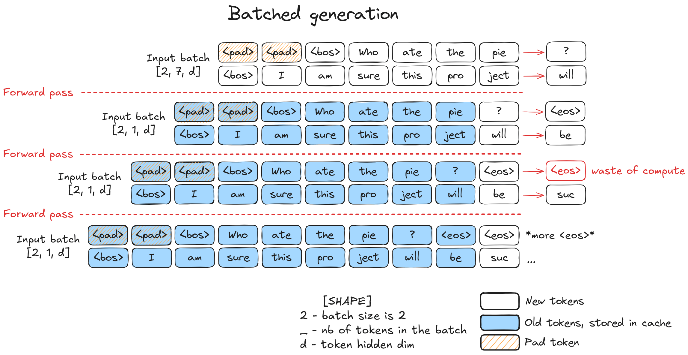
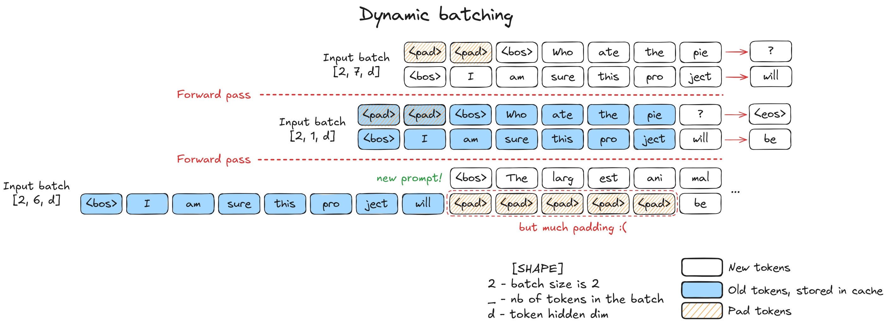
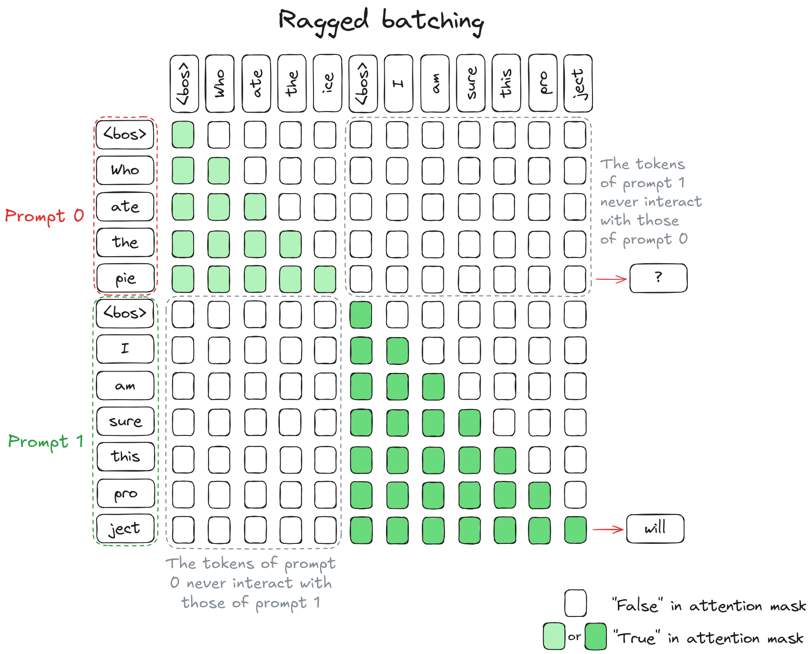
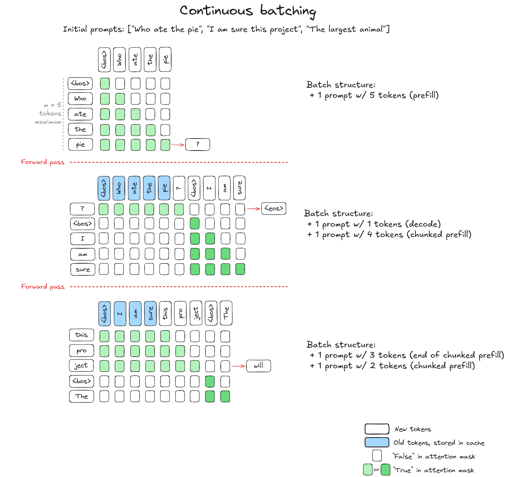

简单来说就是 Batch 的方式不只有平凡地把 `[T, D]` 的 Token 向量 “叠起来” 拼，形成 `[B, T, D]` 的矩阵。在最底层矩阵计算的时候，它被 pytorch 给展平成 `[B * T, D]` 这样一个大矩阵，去做矩阵乘法。

但是直接“叠起来”拼会有不少空间浪费，只能拼接 T 与 D 完全相同的 Token 向量，于是工程师们就基于这一点，直接在 batching 并行的时候，手动拼接，组成一个 `[T1 + T2 + ... , D]` 的大向量，所谓“横着拼”。最妙的是，通过正确的 Casual Mask，每个序列仍然只能看到自己之前的 token，然后本序列的“预测token”会很好的落在当前向量的最后一位，因此各个序列互不干扰，正常并行。

这就是更高效 batching 的思想基础了，各种 batching 也都是针对这一想法的某个优化。

## Batched generation

这个就是最朴素的 batching 思想，用特殊标识 `<pad>` 到同样长度，“叠着拼”放进去推理，在某个序列结束后一直输出 `<eos>` 维持大矩阵的形状。

缺点：很浪费显存，对不同长度的灵活性不足。

## Dynamic batching

在朴素 batching 的基础上，可以在一个序列完成后，将其移除，然后换一个新序列进来 prefill。

与此同时用`<pad>`去留出空间让其完成 prefill 阶段，而其他序列保留 decode 的状态。这主要是为了让系统能区别对待需要 prefill 的序列和 decode 的序列。这两个操作对应的矩阵计算、底层操作是不一样的，不能简单的 SIMT。另外如果硬是要 decode 阶段和 prefill 阶段并行，也会导致慢的 prefill 阶段的 thread 会拖慢很快就算好的 decode thread（为了同步）。因此还是选择多 padding 几个，空间换时间。

缺点：在更换 prompts 的时候需要非常多的 padding

此外，有些优化方法如`torch.compile`要求固定的 tensor shape。这就必须把每个 prompts 序列 pad 到固定的最大长度（新加进来的短 prompt pad 到和旧的一样长），也非常浪费显存。

## Ragged batching

这个就是在文章开头所说的，直接“横着拼”。想明白了之后也很简单，直接把 prompt 拼一下，然后调整 mask 就好了。应该不需要太多解释。

## Continuous Batching

结合 ragged batching 和 dynamic scheduling 就是 **continuous batching** 。既横着拼，也及时地把完成的 prompt 序列移除，加入新的 prompt。

## vLLM 里的具体优化

我在看 continuous batching 的时候就在想，这样直接拼，decode 更新 prompt 序列的时候岂不是要往一整个连续内存的中间插入某个值，是 $O(n)$ 的啊，不得慢死。

后来完整的看了一下 vLLM 的设计思路，原来它是用 PagedAttention 加上 Continuous Batching 来实现的。每个序列都是在“虚拟地址”上，而每个序列的尾部插入实际上是在“虚拟地址”上的尾部插入，是 $O(1)$ 的。拼接的时候把不同 prompt 序列对应的逻辑块整个拼起来，这样虽然浪费了一点点空间，但整体的计算复杂度降下去了。

可以看看我从那片 blog 里扒出来的图片，理解一下。

## 参考资料与图片来源

[Hugging Face - Continuous batching](https://huggingface.co/blog/continuous_batching)

[vLLM 解剖学](https://vllm.ai/blog/anatomy-of-vllm)