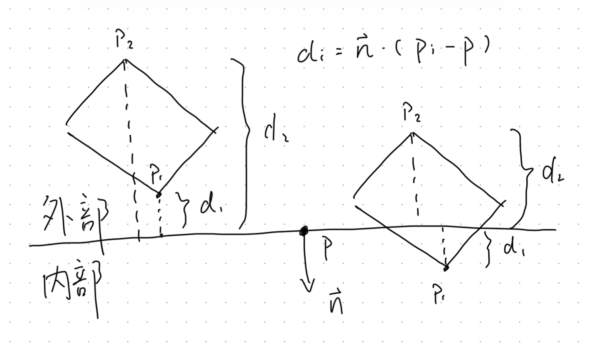
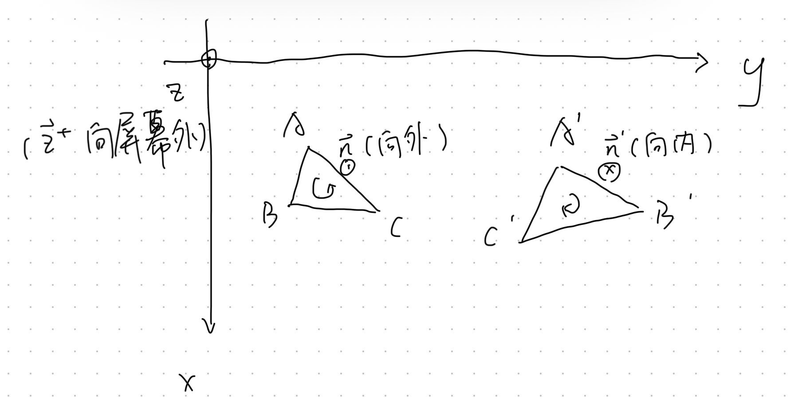
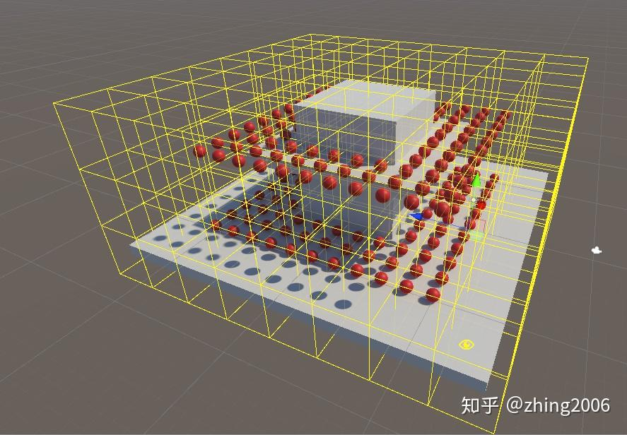
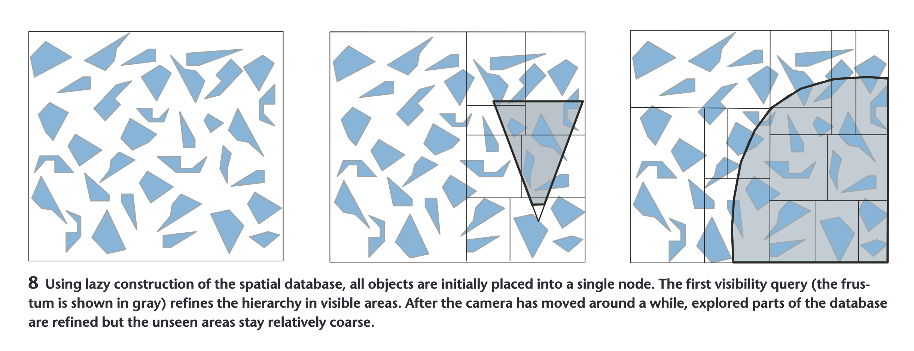
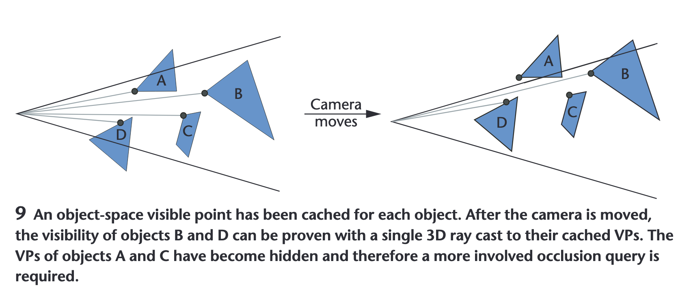
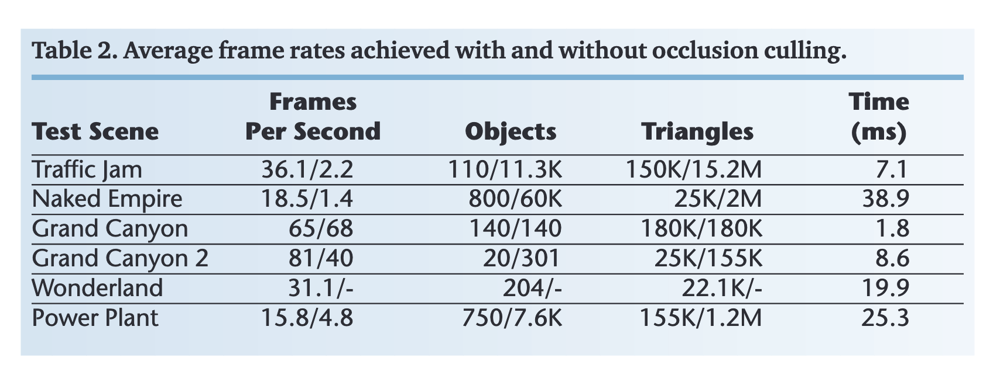

> 为什么写这个系列：
> 
> 面网易雷火引擎实习被狠狠拷打了，发现自己对技术的垂直深度还不够，只知道自己做了什么，但对为什么这么做和做的怎样了解略少。赶紧多多补一下。

## 剔除技术

在计算机3D图形技术中，剔除（Culling）是一种关键的性能优化手段，旨在减少渲染过程中不必要的计算负担。通过在渲染管线的不同阶段排除不可见或不必要的图形元素，剔除技术能够显著提升渲染效率。

## 视锥剔除（Frustum Culling）

视锥剔除为：基于相机的视椎体（平截头体，Frustum），排除位于视野之外（视锥之外）的对象。程序中，使用物体包围盒（如AABB）与视椎体进行相交测试。

数学原理：

一种方法是对所有物体（或包围盒）都做MVP变换，将全部物体都变换为截锥的坐标系统中。之后，所有坐落于$[-1,1]^3$以外的顶点，都在视椎体之外。

另一种方法是对包围盒与视椎体平面，判断是否有交：

1. 每一个视椎体平面取点法式：$(p,\vec{n})$（$p$为平面上任意一点，$\vec{n}$指向视椎体内部）
2. 对包围盒的8个顶点$p_i$，分别求到平面的距离
$$d_i = \vec{n} \cdot (p_i - p)$$
3. 取值最大的 $d_i$（比如$d_1$）：若 $d_1 < 0$，显然整个AABB在平面外；若 $d_1 > 0$，则继续下一步
4. 取值最小的 $d_i$（比如$d_2$）：若 $d_2 < 0$，AABB与平面相交；若 $d_2 > 0$，整个AABB在平面内
5. 对于相交的情况，进行递归计算更小的AABB，若为最小的AABB则整个视作在视椎体内。
6. 对视椎体6个面，每个面8个顶点，每个AABB判断$6\times8$次

## 背面剔除（Backface Culling）

渲染时排除面朝外（不朝着摄像头）的多边形，即为某些多边形的背面，减少不必要的渲染。通常在GPU端执行，利用顶点法线与视角的关系判断可见性。一般设置一个参数就可以完成。背面剔除在流水线中顶点变换之后，光栅化之前。

数学原理：

1. 获取三角形法线：假设三角形按 "A-B-C" 顺序存储，则法线可以通过叉乘得到

$$\vec{n} = \overrightarrow{AB} \times \overrightarrow{AC}$$

2. 与视角方向（如$\vec{z}$）做点积，判断正负

$$ \vec{z} \cdot \vec{n} > 0 \to 正面 $$
$$ \vec{z} \cdot \vec{n} < 0 \to 背面 $$

在右手系中，"逆时针"排布的三个顶点组成的三角形为正对视角，"顺时针"排布的三个顶点组成的三角形背对视角。

（图形API内部有些以$-\vec{z}$为视角方向（如图），有些以$+\vec{z}$为视角方向或使用左手系，要注意一下）

## 像素剔除（Pixel Culling）

对于远处\极小的物体，已经很难被肉眼分辨。

先计算包围盒在屏幕上显示的大小（投影面积），设定一个最小像素阈值，小于该阈值的不进行绘制

或类似光学分辨率算法，计算包围盒的直径R，与物体到相机的距离L，根据 $ratio = R/L$ 来设定阈值。往往采用第二种方法，更加高效。

## 层次视锥裁剪（Hirearchical View Frustum Culling）

在视锥剔除的基础上，利用层次包围体（Bounding Volume Hierarchy, BVH）来加速。

## 遮挡剔除（Occlusion Culling）

排除被其他对象遮挡的元素，避免渲染不可见的部分。

有很多实现方式，在后文详细叙述。

## 潜在可见集（Potentially Visible Sets，PVS）

将空间预先划分为一个一个小Cell，对于每一个Cell区域，先计算出摄像机在这个Cell范围内，能看到的所有物体，并将可见物体的信息打表存下来。在实际运行渲染时，通过查表来得到所有静态物体的可见信息。

优点：
* 运行开销小
* 运行开销稳定

缺点：
* 无法剔除动态物体
* 额外空间去存储遮挡信息
* 需要进行预处理

（偷了张图）

## 动态潜在可见集（Dynamic Potentially Visible Sets，dPVS）

### 核心原理：

* 动态空间数据库（Dynamic Spatial Database）：使用基于轴对齐的BSP树的层次结构来组织场景中的对象。这种结构允许快速的插入、删除和更新操作，适应动态场景中对象的频繁变动。
* 视椎体剔除（View Frustum Culling）：快速排除位于摄像机视野外的对象
* 遮挡剔除（Occlusion Culling）

混合使用轴对齐包围盒AABB与有向包围盒OBB。

每次查询使用有限时间对数据库进行优化，同时，数据库支持随时插入和删除物体。

数据库里可以只存简单的面数更少的包围体，以减轻压力。同时数据库还支持无损压缩，支持4：1的压缩率。

每次查询时，空间数据库会执行类似"从前向后"的遍历进行分层遍历，每个节点的可见性由**可见性求解器**判定，如果某个节点被判断为可见，则会继续测试其子节点及其中包含的对象的可见性；否则，跳过所有子层级。

对于可见对象，系统会判断是否能作为遮挡物，如果可，就放到队列中。后续查询时，会从队列中取出，并被光栅化到遮挡图中。可见性求解器通过渐进式和惰性计算执行所有操作。如：遮挡物是在运行时选取，但其光栅化是在他们实际被需要时才执行。

### 动态空间数据库

采用轴对齐的BSP树，允许以任意顺序选择划分平面，如x-y-z-z-y，并允许每个划分平面在轴上自由选择位置。

* 比起八叉树，这种可调划分平面的结构能更紧密的适应场景几何形状
* 比起任意方向的BSP树，在构建和维护上快几个数量级
* 选择划分平面的策略是最小化所生成子节点的表面积

### 使用动态建树：

* 一开始只创建包围全部包围盒的根节点。
* 可见性查询后，遍历全部**可见**的节点，进行细分，将层次结构向下推进
* 相机**移动后**，新的高层次节点变得可见，并被细分
* 惰性的细分节点，使建树的成本分摊到较长的时间中
* 细分到一个节点包含10个物体时停止
* 物体可以属于多个节点，使用时间戳，保证每个查询中每个物体只处理一次

边缘数据处理：物体的包围盒与节点的包围盒相交时，放入节点

### 物体更新处理
即物体的变换矩阵更新或模型数据更新：

* 先看能不能归属到原来的节点，是，则不做更新
* 否，则将物体不断向上层节点移动，直到能被包围住，并标记此**节点**为修改
* 等下一次查询时，再对该物体进行准确的细分到子节点

### 临时包围体

临时包围体（Temporal Bounding Volume，TBV）：将物体划分为动态和静态。一段时间内未被修改的物体视作静态，用准确的包围体包裹。而动态物体则是使用在一定时间内均可以包住该对象的TBV。

TBV进用作将物体放入空间数据库以及粗略的视椎体剔除。对象级的剔除使用有向包围盒（OBB）。当动态物体移出TBV时扩大TBV，当TBV可见但是物体的OBB不可见时，缩小TBV。采用基于历史运动来预测TBV的扩展或收缩方向，这样可以为特定方向运动的物体生成更加合理的TBV（车，电梯或人）。

测试：在“Traffic Jam test”中，仅有0.2%的对象更新导致了数据库的修改。在可见性查询消耗的CPU时间中，仅有5%用于数据库维护。

此外，将可见性查询的2.5%的CPU时间分配给更新数据库节点，工作包含细分包含大量对象的节点，合并仅含少量对象的节点，重新计划节点的划分平面等。通过严格的时间预算保证可见性查询的输出稳定性。

在paper实现中，作者注意到可见性查询受制于内存带宽，因此使用了自定义的内存管理器来为小型数据结构提供内存池和allocator。以及其他许多内存优化（详见paper）。

### 对Portal的优化

将建筑环境等，用多个空间数据库进行表述，并由传送门进行连接。传送门和其他对象一样放在大的数据库中，一样进行剔除。同时传送门包含一个特殊的扭曲矩阵（warp matrix），当可见性查询穿过传送门时调用矩阵，以实现特殊效果（如镜子）。传送门可以缩小摄像机的视椎体，以紧紧贴合传送门（标准的Portal Culling，后文进行详细叙述）。

### 对光源的优化

根据光照衰减模型确定光照的影响范围（Region of Influence，ROI）。因此将点光源用球体包围，将聚光灯用圆锥包围等。在确定了可见物体与可见ROI之后，可以使用独特的扫描剪枝，在O(物体数+ROI数)的时间内，找出重叠的对象与ROI对，并提交给程序，用于优化GPU光照处理，减少计算开销。

### 可见性求解器

负责遮挡剔除和贡献剔除（contribution culling）的组件。为覆盖信息和深度信息单独维护层次缓冲区，以优化高分辨率下的效率。

### 可见点追踪

可见点追踪（Visible point Tracking，VPT）在dPVS中被用于优化查询。在可见对象的内部生成一个点，来替代物体。每次对可见物体进行缓存，下一次查询中紧紧对这个点进行测试。这可以优化数据库每一层查询的时候，许多一直保持可见的对象和节点，不用重复进行测试。VPT优化替代了90%以上针对可见对象的遮挡查询。VPT可以被看做是一种统一的提前退出测试机制，适用于各种可见性查询。

如果可见点被遮挡，会先用一个轴对齐的，只有一个深度的矩形进行深度测试。如果这个矩形可见，再进行OBB的可见性测试。这一操作增加了10%计算量，但是能使最终被判定为可见的对象数量减少25%。

### 选取遮挡体

如何高效选取遮挡体（Occluder）:选择算法基于成本/收益估计。一个对象会被认为是潜在遮挡体，当其预期收益超过预期成本时。对象的渲染成本通过其三角形数量、近似投影面积以及一个复杂度项来估算；遮挡成本是将该对象栅格化到层次化遮挡图中所需的预估时间，该估算基于轮廓边的数量和对象在屏幕上的大小。预期收益则是指如果该对象被用作遮挡体，所能剔除的其他对象的总渲染成本。

算法通过将屏幕划分为$64\times 64$像素的tile，来估算遮挡体的收益。维护一个遮挡体列表，查询中每个对象遮挡住一个tile时，记录遮挡体收益。对于树的节点，遮挡收益平分到对象中。用这个“遮挡体收益”列表来分析哪些物体适合作为遮挡体，哪些可以丢弃。对刚刚从不可见变为可见的物体，都先视为遮挡体，直到经过数据的验证。

使用延迟处理遮挡体，可以在场景深度复杂度低的时候，显著减少遮挡剔除的开销。比如，俯视地图时，遮挡剔除基本没有效果，因此算法可以丢弃97%到99%的遮挡体。

轮廓提取：

（略了，有三大段，用于给一个物体构建轮廓，小的用暴力提取，大的有专门算法处理）

实现具体问题：用优化方法解决内存带宽

效果：

## 参考

[知乎专栏：实时渲染第四版](https://zhuanlan.zhihu.com/p/406606440)

[知乎专栏：实时渲染高级特性开发](https://zhuanlan.zhihu.com/p/363277669)

[dPVS paper](https://ieeexplore.ieee.org/document/1274066)

## TODO

- [x] 潜在可见集（Potential Visible Sets，PVS）
- [x] 动态潜在可见集（Dynamic Potential Visible Sets，PVS）
- [ ] 入口剔除（Poral Culling）
- [ ] 层次化遮挡剔除（Hierarchical），HZB
- [ ] 硬件遮挡查询（Occlusion Query）
- [ ] 软光栅（Software Occlusion）