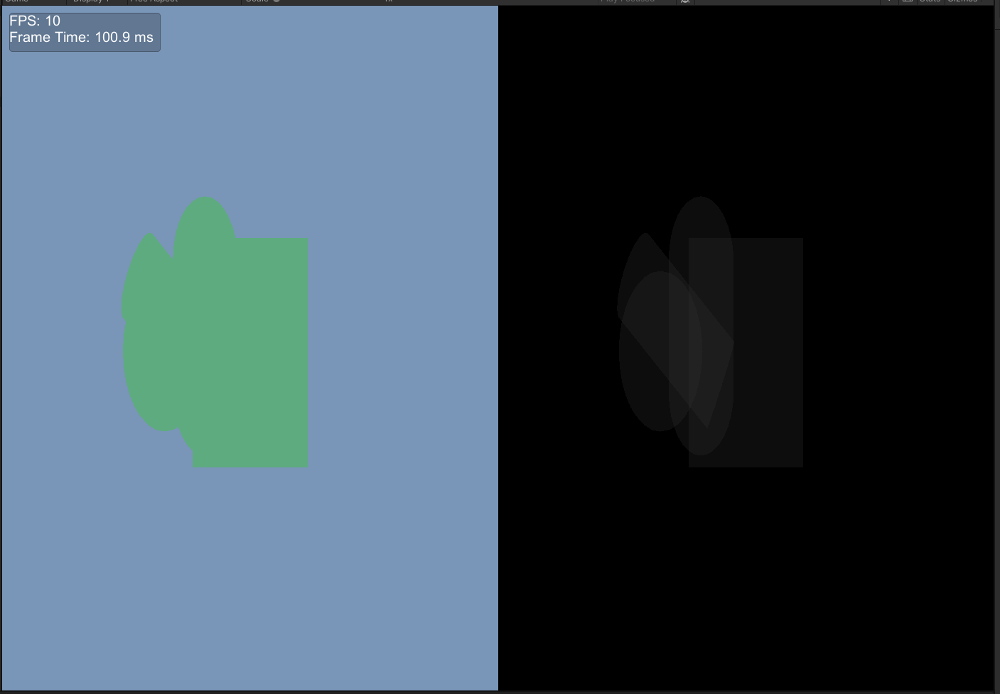

> Context: unity上实现一个功能：
> 使用srp管线，实现一个功能，每10帧生成一张图，图的左边是整个屏幕内容；图的右边是也是屏幕里的内容，只不过是显示的overdraw现象，一个相素点每被多渲染一次，就RGB的值就加1。
> 
> 而且要一晚上完成（啊？我吗？我真没学过这么深的Unity）

但是好像真写出来了，酷！简单记一下，防止起床就忘了是怎么写的了。

## 实现基础SRP

首先，创建一个新Project，主播这里用版本的是2022.3.55f1c1，选择3D（Built in pipeline）模板创建项目。

### 开启SRP

参照Unity的[文档](https://docs.unity3d.com/2022.3/Documentation/Manual/srp-creating-render-pipeline-asset-and-render-pipeline-instance.html)：

在一切开始前，先往场景里丢几个物体（基础方块、球体等等），并摆好和相机的相对位置，等后续管线配好就可以直接看到这些物体。

创建一个C#文件```MyBasicRenderPipelineAsset.cs```先为SRP创建对应的右键菜单，同时定义```RenderPipelineAsset```的子类，给Unity使用：

```csharp
using UnityEngine;
using UnityEngine.Rendering;

[CreateAssetMenu(menuName = "Rendering/MyBasicRenderPipelineAsset")]
public class MyBasicRenderPipelineAsset : RenderPipelineAsset
{
    protected override RenderPipeline CreatePipeline()
    {
        return new MyBasicRenderPipeline();
    }
}
```

此时，类```MyBasicRenderPipeline```还没有创建，因此再创建一个C#文件```MyBasicRenderPipeline.cs```：

```csharp
using UnityEngine;
using UnityEngine.Rendering;

public class MyBasicRenderPipeline : RenderPipeline
{
    public MyBasicRenderPipeline(bool enableDualViewport)
    {
        
    }

    protected override void Render(ScriptableRenderContext context, Camera[] cameras)
    {
        
    }
}
```

随后在Project-Assets面板中，右键->Create->Rendering->MyBasicRenderPipelineAsset，会在Assets中创建一个```MyBasicRenderPipelineAsset```的实例（将第一段代码中的类实例化）。

接着，打开Edit->Project Settings->Graphic。在Scriptable Render Pipelines Settings的一行中，点进去，选择新创建的PipelineAsset。

此时，Scene面部和Game面板应该会是黑乎乎一片，虽然什么都没有，但是成功用上可编程管线了。

### 基础渲染

进一步完善```MyBasicRenderPipeline.cs```：

```csharp
using UnityEngine;
using UnityEngine.Rendering;

public class MyBasicRenderPipeline : RenderPipeline
{
    protected override void Render(ScriptableRenderContext context, Camera[] cameras)
    {
        foreach (Camera camera in cameras)
        {
            context.SetupCameraProperties(camera); // 更新相机参数到 context

            CommandBuffer cmd = new CommandBuffer();

            cmd.ClearRenderTarget(true, true, camera.backgroundColor);
            context.ExecuteCommandBuffer(cmd);
            cmd.Release();

            // Culling
            camera.TryGetCullingParameters(out ScriptableCullingParameters cullingParameters)
            CullingResults cullingResults = context.Cull(ref cullingParameters);

            // 使用 Unity 内置的 "Unlit/Color" Shader 来渲染物体
            ShaderTagId shaderTagId = new ShaderTagId("SRPDefaultUnlit"); // Universal RP 使用这个 Tag
            SortingSettings sortingSettings = new SortingSettings(camera) { criteria = SortingCriteria.CommonOpaque };
            DrawingSettings drawingSettings = new DrawingSettings(shaderTagId, sortingSettings);
            FilteringSettings filteringSettings = FilteringSettings.defaultValue; // 只渲染不透明物体

            context.DrawRenderers(cullingResults, ref drawingSettings, ref filteringSettings);
            context.Submit();
        }
    }
}
```

这里用了"SRPDefaultUnlit" Shader来渲染物体，要为物体添加一个特殊材料指定使用这个Shader。

Assets->右键->Create->Material。选中Material，在右侧Inspector中，Shader选择Unlit/Color，选个喜欢的颜色。

分别选中场景里的每个物体，设置为使用此Material。再点击运行，就可以看到物体被渲染到屏幕上了。

额外参考：[知乎：从零开始SRP](https://zhuanlan.zhihu.com/p/380969365)

## 分屏显示

这一环节要实现同一屏幕左右显示两份渲染结果的功能。咨询了一下GPT老师，建议我使用Render to Texture，再使用Canvas绘制两遍；或者是设置两个Camera在同一位置。可惜这些应该都太不优雅了，应当在SRP中直接实现渲染两份输出的效果。

这里进一步修改```RenderPipeline```的代码：

```csharp
using UnityEngine;
using UnityEngine.Rendering;

public class MyBasicRenderPipeline : RenderPipeline
{
    // 这个方法是每一帧渲染的入口点
    protected override void Render(ScriptableRenderContext context, Camera[] cameras)
    {
        // 遍历场景中所有需要渲染的相机
        foreach (Camera camera in cameras)
        {
            CommandBuffer cmd = new CommandBuffer();

            cmd.name = "Initial Full Clear to Black";
            cmd.ClearRenderTarget(true, true, Color.black); // 清除整个渲染目标为黑色
            context.ExecuteCommandBuffer(cmd);
            cmd.Clear();

            context.SetupCameraProperties(camera);

            camera.TryGetCullingParameters(out ScriptableCullingParameters cullingParameters);
            CullingResults cullingResults = context.Cull(ref cullingParameters);

            ShaderTagId shaderTagId = new ShaderTagId("SRPDefaultUnlit");
            SortingSettings sortingSettings = new SortingSettings(camera)
            {
                criteria = SortingCriteria.CommonOpaque // 对不透明物体排序
            };
            DrawingSettings drawingSettings = new DrawingSettings(shaderTagId, sortingSettings);
            FilteringSettings filteringSettings = FilteringSettings.defaultValue; // 默认渲染所有可见物体

            // --- 开始渲染左半部分 ---
            cmd.name = "Render Left Half";

            // 设置左半边视口
            Rect leftViewport = new Rect(0, 0, camera.pixelWidth * 0.5f, camera.pixelHeight);
            cmd.SetViewport(leftViewport);

            cmd.ClearRenderTarget(true, true, camera.backgroundColor);
            context.ExecuteCommandBuffer(cmd); // 执行设置视口和清除的命令
            cmd.Clear();

            context.DrawRenderers(cullingResults, ref drawingSettings, ref filteringSettings);
            // --- 左半部分渲染结束 ---

            cmd.name = "Render Right Half";
            // 设置右半边视口
            Rect rightViewport = new Rect(camera.pixelWidth * 0.5f, 0, camera.pixelWidth * 0.5f, camera.pixelHeight);
            cmd.SetViewport(rightViewport);

            cmd.ClearRenderTarget(true, true, camera.backgroundColor);
            context.ExecuteCommandBuffer(cmd); // 执行设置视口和清除的命令
            cmd.Clear();

            // 在右半边绘制几何体
            context.DrawRenderers(cullingResults, ref drawingSettings, ref filteringSettings);
            // --- 右半部分渲染结束 ---

            cmd.Release();
            context.Submit();
        }
    }
}
```

这个比较简单，通过设置视口（ViewPort），让渲染结果分别写到左右两边，渲染两次产生两次输出就行。

## 实现Overdraw效果

Overdraw的功能实现倒是很简单，只要Shader里面改为加性混合就行，但第一次写Unity Shader的我可就难受了。

> 踩坑记录：
> 
> 主播最开始使用了```#include "Packages/com.unity.render-pipelines.core/ShaderLibrary/Common.hlsl"```，这个库来提供Unity的一些内置变量和函数，但是这个多半是deprecated了，报错报错Cannot Include，或者就是各种变量、函数反复报错undefined，修了几个小时才发现Unity给的Shader模板中使用的是```#include "UnityCG.cginc"```。虽然没细探是什么，但看起来是起到与Common.hlsl一样的作用。随后就可以正常编译shader了。

先写好shader代码：

```hlsl
Shader "Custom/OverdrawVisualizationShader"
{
    Properties
    {
        _Increment("Increment Value", Range(0.001, 0.1)) = 0.00392156
    }

        SubShader
    {
        Tags { "RenderType" = "Opaque" }

        Pass
        {
            Tags { "LightMode" = "OverdrawVisualization" }

            Blend One One
            ZWrite Off
            ZTest LEqual
            Cull Back

            HLSLPROGRAM
            #pragma vertex vert
            #pragma fragment frag

            // #include "Packages/com.unity.render-pipelines.core/ShaderLibrary/Common.hlsl"
            #include "UnityCG.cginc"
        struct Attributes
        {
            float4 positionOS   : POSITION;
        };

        struct Varyings
        {
            float4 positionCS   : SV_POSITION;
        };

        // Unity 会自动提供 unity_ObjectToHClip 矩阵
        // CBUFFER_START(UnityPerFrame)
        //     float4x4 unity_ObjectToHClip;
        // CBUFFER_END

        CBUFFER_START(UnityPerMaterial)
            float _Increment;
        CBUFFER_END

        Varyings vert(Attributes IN)
        {
            Varyings OUT;
            // 手动将顶点从物体空间转换到裁剪空间
            OUT.positionCS = UnityObjectToClipPos(float4(IN.positionOS.xyz, 1.0));
            return OUT;
        }

        float4 frag(Varyings IN) : SV_Target
        {
            // return float4(0.3, 0.0, 0.0, 1.0);
            return float4(_Increment, _Increment, _Increment, 1.0);
        }
        ENDHLSL
    }
    }
        Fallback Off
}
```

其中：```Blend One One```在Unity Shader语法下，为加法混合。```ZWrite Off```，深度测试时不写入，即渲染每个物体的时候都往渲染结果上叠一层。```_Increment```设置为```1/255```（约等于0.0039），即每渲染一次增加1的RGB值。

其余就是比较标准的VS和FS。

随后还要改一下Pipeline代码：

```csharp
using UnityEngine;
using UnityEngine.Rendering;

public class MyBasicRenderPipeline : RenderPipeline
{
    private bool _enableDualViewportEffect;
    // 为 Overdraw Shader 定义 ShaderTagId
    private static readonly ShaderTagId _overdrawShaderTagId = new ShaderTagId("OverdrawVisualization");
    private static readonly ShaderTagId _normalShaderTagId = new ShaderTagId("SRPDefaultUnlit");


    public MyBasicRenderPipeline(bool enableDualViewport)
    {
        _enableDualViewportEffect = enableDualViewport;
    }

    protected override void Render(ScriptableRenderContext context, Camera[] cameras)
    {
        foreach (Camera camera in cameras)
        {
            bool applyDualViewport = camera.cameraType == CameraType.Game &&
                                     _enableDualViewportEffect &&
                                     Application.isPlaying;

            if (applyDualViewport)
            {
                RenderDualViewport(context, camera);
            }
            else
            {
                RenderSingleViewport(context, camera);
            }
        }
    }

    void RenderSingleViewport(ScriptableRenderContext context, Camera camera)
    {
        context.SetupCameraProperties(camera);

        CommandBuffer cmd = new CommandBuffer();
        cmd.name = "Render Single Viewport";
        cmd.ClearRenderTarget(true, true, camera.backgroundColor);
        context.ExecuteCommandBuffer(cmd);
        cmd.Release();

        camera.TryGetCullingParameters(out ScriptableCullingParameters cullingParameters);
        CullingResults cullingResults = context.Cull(ref cullingParameters);

        SortingSettings sortingSettings = new SortingSettings(camera)
        {
            criteria = SortingCriteria.CommonOpaque
        };
        DrawingSettings drawingSettings = new DrawingSettings(_normalShaderTagId, sortingSettings);
        FilteringSettings filteringSettings = FilteringSettings.defaultValue;

        context.DrawRenderers(cullingResults, ref drawingSettings, ref filteringSettings);
        context.Submit();
    }

    void RenderDualViewport(ScriptableRenderContext context, Camera camera)
    {
        CommandBuffer cmd = new CommandBuffer();

        cmd.name = "Dual View - Initial Full Clear to Black";
        cmd.ClearRenderTarget(true, true, Color.black); // 整体背景清为黑色
        context.ExecuteCommandBuffer(cmd);
        cmd.Clear();

        context.SetupCameraProperties(camera);

        camera.TryGetCullingParameters(out ScriptableCullingParameters cullingParameters);
        CullingResults cullingResults = context.Cull(ref cullingParameters);

        cmd.name = "Dual View - Render Left Half (Normal)";
        Rect leftViewport = new Rect(0, 0, camera.pixelWidth * 0.5f, camera.pixelHeight);
        cmd.SetViewport(leftViewport);
        cmd.ClearRenderTarget(true, true, camera.backgroundColor);
        context.ExecuteCommandBuffer(cmd);
        cmd.Clear();

        SortingSettings normalSortingSettings = new SortingSettings(camera)
        {
            criteria = SortingCriteria.CommonOpaque
        };
        // 使用正常的 ShaderTagId
        DrawingSettings normalDrawingSettings = new DrawingSettings(_normalShaderTagId, normalSortingSettings);
        FilteringSettings filteringSettings = FilteringSettings.defaultValue; // 或者根据需要过滤

        context.DrawRenderers(cullingResults, ref normalDrawingSettings, ref filteringSettings);
        // --- 左半部分渲染结束 ---

        cmd.name = "Dual View - Render Right Half (Overdraw)";
        Rect rightViewport = new Rect(camera.pixelWidth * 0.5f, 0, camera.pixelWidth * 0.5f, camera.pixelHeight);
        cmd.SetViewport(rightViewport);
        // 因为要进行加法混合来累积 Overdraw 值，将右半边清除为黑色，
        cmd.ClearRenderTarget(true, true, Color.black);
        context.ExecuteCommandBuffer(cmd);
        cmd.Clear();

        SortingSettings overdrawSortingSettings = new SortingSettings(camera)
        {
            criteria = SortingCriteria.CommonOpaque
        };
        // 使用为 Overdraw Shader 定义的 ShaderTagId
        DrawingSettings overdrawDrawingSettings = new DrawingSettings(_overdrawShaderTagId, overdrawSortingSettings);

        context.DrawRenderers(cullingResults, ref overdrawDrawingSettings, ref filteringSettings);
        // --- 右半部分渲染结束 ---

        cmd.Release();
        context.Submit();
    }
}
```

通过ShaderTag获取ShaderTagId，分配给左右两边的DrawSettings，然后配置渲染。

到这一步，直接运行会发现右半边全黑，怎么回事呢？

不过主播很细节的尝试了一个方法，把前面创建的Material的Shader重新设定为我们配置的```Custom/OverdrawVisualizationShader```，就可以在右边屏幕出现预期的Overdraw效果了。不过此时左边就消失不见了，不是很符合同时显示的预期啊。

## 左右同时显示不同结果

想到SRP是通过Override的方式替代Built in管线的，Shader应该也可以使用Override的方式来替换掉Material里面选定的Unlit/Color Shader。尝试了使用```overdrawDrawingSettings.overrideShader,overdrawDrawingSettings.overrideShaderIndex```这两个配置设置进行Shader的Override，但好像这样子```_Increment```变量用Debugger抓出来直接为```0.000000```，FS直接输出纯黑像素，不能按预期进行叠加混合，最终显示图像也是一片纯黑，按这种方法研究了一会，没找到解决办法。

于是退而求其次，直接Override整个Material了，并将```_Increment```改为从C#代码传值。

此外，还增加了一个开关，可以让渲染Scene面部时，不会像前面一样显示左右两张图，方便我们调整场景。


```MyBasicRenderPipelineAsset.cs```如下：
```csharp
using UnityEngine;
using UnityEngine.Rendering;

[CreateAssetMenu(menuName = "Rendering/MyBasicRenderPipelineAsset")]
public class MyBasicRenderPipelineAsset : RenderPipelineAsset
{
    // 添加一个公开的布尔变量作为开关
    public bool enableDualViewportInGameViewWhilePlaying = false;

    protected override RenderPipeline CreatePipeline()
    {
        // 将开关的状态传递给渲染管线实例
        return new MyBasicRenderPipeline(enableDualViewportInGameViewWhilePlaying);
    }
}
```

```MyBasicRenderPipeline.cs```代码如下：

```csharp
using UnityEngine;
using UnityEngine.Rendering;

public class MyBasicRenderPipeline : RenderPipeline
{
    private bool _enableDualViewportEffect;
    private static readonly ShaderTagId _overdrawShaderTagId = new ShaderTagId("OverdrawVisualization");
    private static readonly ShaderTagId _normalShaderTagId = new ShaderTagId("SRPDefaultUnlit");

    private Material _overdrawEffectMaterial;

    private Shader _overdrawVisualizationShaderInstance; // 用于存储 overdraw shader 对象

    public MyBasicRenderPipeline(bool enableDualViewport)
    {
        _enableDualViewportEffect = enableDualViewport;

        // 加载 Overdraw Visualization Shader
        _overdrawVisualizationShaderInstance = Shader.Find("Custom/OverdrawVisualizationShader");
        if (_overdrawVisualizationShaderInstance == null)
        {
            Debug.LogError("未找到 \"Custom/OverdrawVisualizationShader\"！右侧视口的 overdraw 效果将无法正常工作。");
        }
        else
        {
            _overdrawEffectMaterial = new Material(_overdrawVisualizationShaderInstance);
            _overdrawEffectMaterial.SetFloat("_Increment", 0.00392156f); // = 1/255
        }
    }

    protected override void Render(ScriptableRenderContext context, Camera[] cameras)
    {
        foreach (Camera camera in cameras)
        {
            bool applyDualViewport = camera.cameraType == CameraType.Game &&
                                     _enableDualViewportEffect &&
                                     Application.isPlaying;

            if (applyDualViewport)
            {
                RenderDualViewport(context, camera);
            }
            else
            {
                RenderSingleViewport(context, camera);
            }
        }
    }

    void RenderSingleViewport(ScriptableRenderContext context, Camera camera)
    {
        context.SetupCameraProperties(camera);

        CommandBuffer cmd = new CommandBuffer();
        cmd.name = "Render Single Viewport";
        cmd.ClearRenderTarget(true, true, camera.backgroundColor);
        context.ExecuteCommandBuffer(cmd);
        cmd.Release();

        camera.TryGetCullingParameters(out ScriptableCullingParameters cullingParameters);
        CullingResults cullingResults = context.Cull(ref cullingParameters);

        SortingSettings sortingSettings = new SortingSettings(camera)
        {
            criteria = SortingCriteria.CommonOpaque
        };
        // 对于单个视口，使用正常的 shader 标签进行绘制
        DrawingSettings drawingSettings = new DrawingSettings(_normalShaderTagId, sortingSettings);
        FilteringSettings filteringSettings = FilteringSettings.defaultValue;

        context.DrawRenderers(cullingResults, ref drawingSettings, ref filteringSettings);
        context.Submit();
    }

    void RenderDualViewport(ScriptableRenderContext context, Camera camera)
    {
        CommandBuffer cmd = new CommandBuffer();

        cmd.name = "Dual View - Initial Full Clear to Black";
        cmd.ClearRenderTarget(true, true, Color.black);
        context.ExecuteCommandBuffer(cmd);
        cmd.Clear();

        context.SetupCameraProperties(camera);

        camera.TryGetCullingParameters(out ScriptableCullingParameters cullingParameters);
        CullingResults cullingResults = context.Cull(ref cullingParameters);

        // --- 渲染左半部分 (正常渲染) ---
        cmd.name = "Dual View - Render Left Half (Normal)";
        Rect leftViewport = new Rect(0, 0, camera.pixelWidth * 0.5f, camera.pixelHeight);
        cmd.SetViewport(leftViewport);
        cmd.ClearRenderTarget(true, true, camera.backgroundColor); // 使用相机的原始背景色清除左半部分
        context.ExecuteCommandBuffer(cmd);
        cmd.Clear();

        SortingSettings normalSortingSettings = new SortingSettings(camera)
        {
            criteria = SortingCriteria.CommonOpaque
        };
        

        DrawingSettings normalDrawingSettings = new DrawingSettings(_normalShaderTagId, normalSortingSettings);
        FilteringSettings filteringSettings = FilteringSettings.defaultValue;

        context.DrawRenderers(cullingResults, ref normalDrawingSettings, ref filteringSettings);
        // --- 左半部分渲染结束 ---

        // --- 渲染右半部分 (Overdraw 可视化) ---
        cmd.name = "Dual View - Render Right Half (Overdraw)";
        Rect rightViewport = new Rect(camera.pixelWidth * 0.5f, 0, camera.pixelWidth * 0.5f, camera.pixelHeight);
        cmd.SetViewport(rightViewport);
        // 将右半部分清除为黑色，用于 overdraw shader 的加法混合
        cmd.ClearRenderTarget(true, true, Color.black);
        context.ExecuteCommandBuffer(cmd);
        cmd.Clear();

        SortingSettings overdrawSortingSettings = new SortingSettings(camera)
        {
            criteria = SortingCriteria.CommonOpaque
        };

        DrawingSettings overdrawDrawingSettings = new DrawingSettings(_normalShaderTagId, overdrawSortingSettings);

        if (_overdrawVisualizationShaderInstance != null)
        {
            overdrawDrawingSettings.overrideMaterial = _overdrawEffectMaterial;
            // overdrawDrawingSettings.overrideShader = _overdrawVisualizationShaderInstance;
            // overdrawDrawingSettings.overrideShaderPassIndex = 0;
        }

        context.DrawRenderers(cullingResults, ref overdrawDrawingSettings, ref filteringSettings);
        // --- 右半部分渲染结束 ---

        cmd.Release();
        context.Submit();
    }
}
```

shader代码与前一个shader代码块相同。

就实现了预期的任务目标。

<center></center>

## 控制渲染帧数

这个简单，关闭垂直同步，再设定```Application.targetFrameRate```就行。

新增一个```FrameDisplay.cs```，不仅设置帧率，还将帧率显示到渲染结果中：

```csharp
using UnityEngine;

public class FrameDisplay : MonoBehaviour
{
    private float deltaTime = 0.0f;
    public Vector2 position = new Vector2(10, 10);
    public int fontSize = 20;
    public Color textColor = Color.white;
    public bool showBackground = true;
    public Color backgroundColor = new Color(0, 0, 0, 0.5f);

    private GUIStyle style;
    private Rect rect;

    void Start()
    {
        style = new GUIStyle();
        style.fontSize = fontSize;
        style.normal.textColor = textColor;

        QualitySettings.vSyncCount = 0;
        Application.targetFrameRate = 10;
    }

    void Update()
    {
        deltaTime += (Time.unscaledDeltaTime - deltaTime) * 0.1f;
    }

    void OnGUI()
    {
        float fps = 1.0f / deltaTime;
        float frameTime = deltaTime * 1000.0f;

        string text = string.Format("FPS: {0:0.} \nFrame Time: {1:0.0} ms", fps, frameTime);

        Vector2 size = style.CalcSize(new GUIContent(text));
        rect = new Rect(position.x, position.y, size.x + 10, size.y + 10);

        if (showBackground)
        {
            GUI.backgroundColor = backgroundColor;
            GUI.Box(rect, GUIContent.none);
        }

        GUI.Label(rect, text, style);
    }
}
```

重点：
```csharp
QualitySettings.vSyncCount = 0;
Application.targetFrameRate = 10;
```