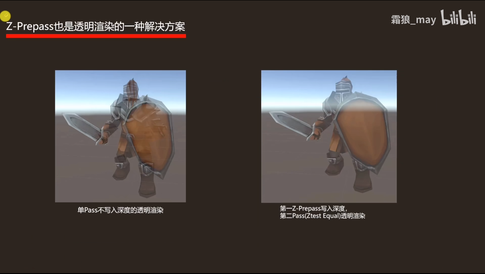
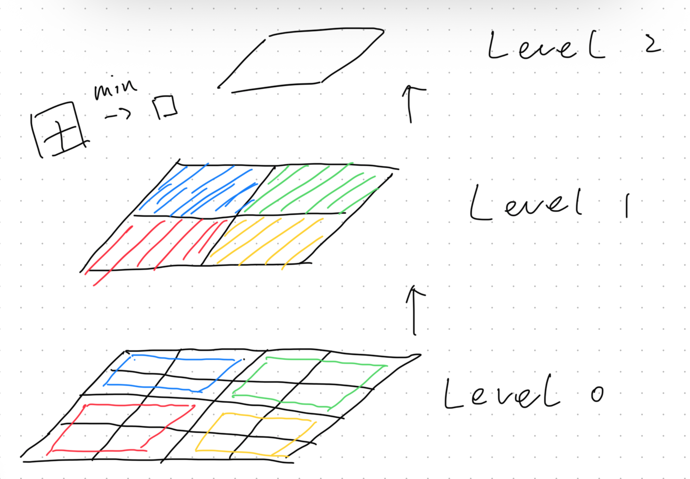
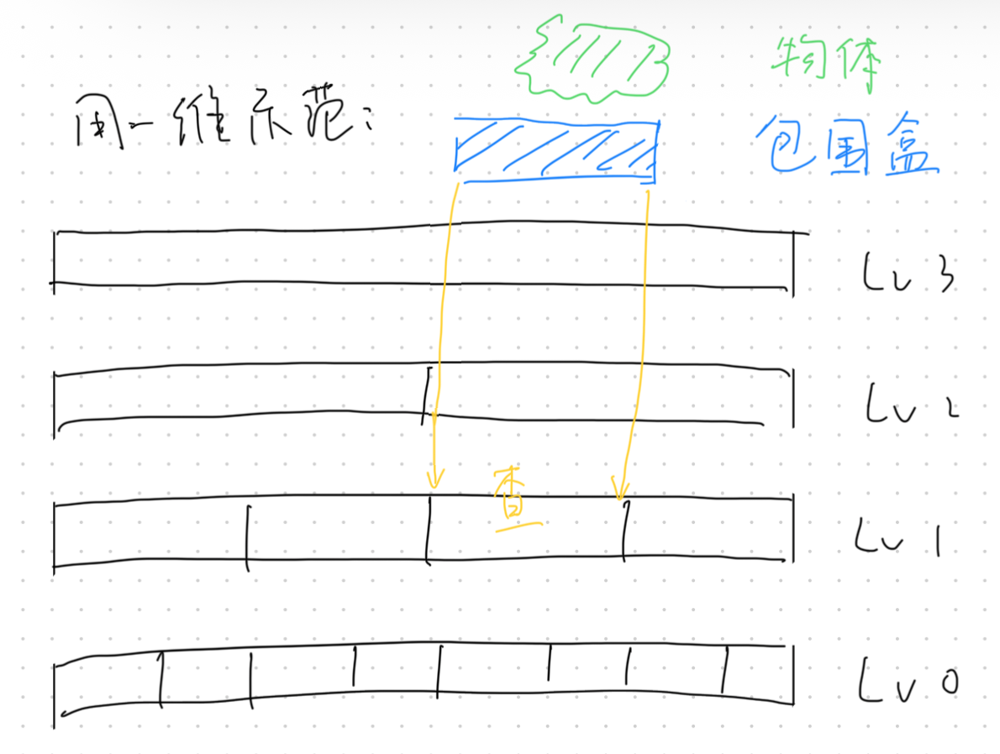
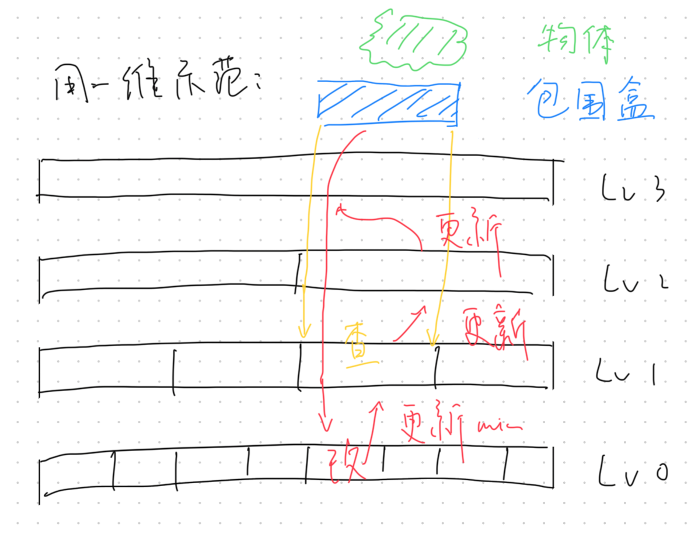

> 在本文中，视角方向为$z$轴负方向 $(-\vec{z})$，$z$值越大，离摄像机越近。

正常的渲染管线为

顶点着色器 $\to$ 曲面细分 $\to$ 几何着色器 $\to$ 光栅化 $\to$ 片元着色器 $\to$ 透明度测试 $\to$ 模板测试 $\to$ 深度测试

## Z-Test

解决物体相互遮挡的问题，每个像素只有在最前面（深度值最大）的片元才会被渲染出来。

## Early-Z

在传统渲染管线中，深度测试是在Blend之前，而此时的片元已经进行了片元着色器的计算，如果深度测试后被舍弃，就会造成大量无用的计算。

Early-Z技术可以在光栅化之后，片元着色器之前进行一次深度测试，没用通过测试的片元直接丢弃，不通过片元着色器计算，以提高性能。

### 失效（ineffective）的情况

* 开启Alpha Test，或Clip/Discard等手动丢弃片元的操作
    * 可能会在Alpha Test阶段，丢弃本应在最前面的片元
    * 但其遮挡的片元已经抛弃，会导致这一方向出现一个空洞
* 手动修改GPU插值得到的深度
    * 同上，会导致渲染不正常
* 启用Alpha Blend
    * 一般对应物体会关闭深度测试
* 关闭深度测试

### 高效利用Early-Z

在渲染的时候，令不透明物体从近往远渲染，发挥Early-Z最大性能。比如用CPU先把物体由近往远排序号，再交给GPU进行渲染。

### Z-Prepass

参考[BV1FK4y1u7iw](https://www.bilibili.com/video/BV1FK4y1u7iw)，但其实没看懂意义何在。

为解决Early-Z中，片元由远到近被渲染时，Early-Z**效率低**，使用Z-Prepass对Early-Z进行优化，先进行一次Z-Test，只写入深度。再进行一次Z-Test，只在深度相等的时候，写入颜色。（笔者：但是这真会提升性能吗？）

也可以解决透明物体渲染的问题：

传统渲染透明物体流程：

1. 渲染不透明物体，开启深度写入
2. 剔除透明物体正面，渲染透明物体背面，关闭深度写入（透明物体不再更新Z-Buffer）
3. 渲染透明物体正面，关闭深度写入

采用Z-Prepass：

1. 先准备Z-Buffer
    1. 只对不透明物体
    2. 关闭背面剔除
    3. 开启深度写入
    4. 关闭颜色写入
2. 渲染不透明物体，关闭背面剔除，关闭深度写入，深度测试选择“相等”
3. 渲染透明物体背面
4. 渲染透明物体正面

（笔者：这真有任何提升吗？？？）

## Z-Culling

early-z是以pixel-quad为单位（4个像素一组），而z-culling是以一个tile为单位（16个像素）。用于Tile Base Rendering（TBR）中。

并且对深度图是只读的，不像early-z会对深度图进行修改。

## Hi-Z（Hierarchical Z-Buffer）

Hi-Z是一种基于多级深度图（Z金字塔）的遮挡剔除技术，它通过构建一个分层（多级）深度缓冲区来快速判定对象或其包围体是否被场景中已有深度信息完全遮挡。

使用的是G-Buffer，几何缓冲区。G-Buffer中存储的是每个像素对应的位置\发现\漫反射颜色和其他参数

### 构建多层Z-Buffer

先构建最高分辨率层（Level0），与最终渲染分辨率一致。

每一层在上一次的基础上，$2\times 2$ 像素合而为一，取最小值（最远）。重复多层，形成类似MIP-map的结构（笔者：二维线段树？）。

### 查询与比较

在渲染中，一般为 Compute Shader 批量测试多个包围体。几何着色器或顶点着色器也可用于逐对象触发测试，后者一般用于少量大型对象。

测试对象为“物体”或其包围体，将物体的顶点变换至屏幕空间，并计算器屏幕空间的包围矩形。

根据包围矩形的最大边长，以$LOD=\lfloor \mathrm{log}_2 \max(w,h) \rfloor$选择对应的层级级别。

与当前级别做对比（只需对比一个像素），设Z-Buffer里值为 $d_{buff}$，物体包围盒的深度为 $d_{obj}$：

* 若$d_{buff} > d_{obj}$，这块区域的最远的物体，都比物体要近，说明物体已被完全遮挡，可直接剔除。

* 若$d_{buff} < d_{obj}$，说明未能完全遮挡，则到下一级进行查询，直到被遮挡，或将深度写入Level0

### 更新

* 未被遮挡的物体若要更新Z-Buffer，一定会从Level0开始写入
* Level0更新后，逐层向上更新
* 更新可以被截断：遇到一个不需要更新的层的时候，再上面的层也不用更新

### 为什么能优化

* 在未做层次化的时候，查询需要对多每一个覆盖的像素查询
* 做了优化之后，可以对一大片像素进行一次查询就行
* 主要是优化了“被遮挡-丢弃”的片元
* 对真正需要更新覆盖的片元反而增加一个更新的工作量(log复杂度)

## 参考

[渲染杂谈](https://juejin.cn/post/6844904132852072462)