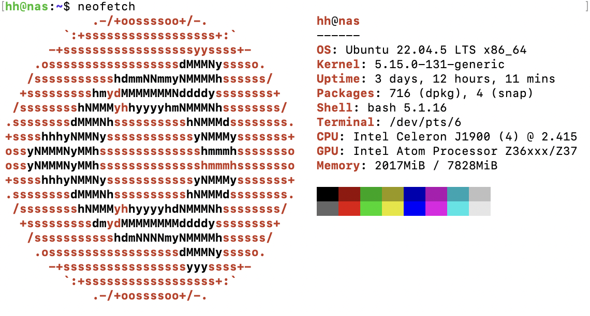

## 写在前面

就，还是抵挡不住诱惑，打算整一台NAS来玩玩。考察了成品NAS，一是嫌贵，主要是卖软件的钱，硬件配置都比较差，二是觉得数据在别的厂商的手里总归是不踏实的。于是选择了DIY，使用Ubuntu作为NAS系统配合各种软件实现NAS的各种功能。此外为了避免依赖打架，在选取软件的时候都尽可能的选取docker化的软件来实现部署。

## 功能列表

我对NAS主要是有如下几个需求（附上施工进度）：

- [x] 科学上网
- [x] 文件中转
- [x] 文件下载
- [x] 照片备份
- [ ] 文件备份
- [ ] 影视库
- [ ] 全盘快照

## 系统配置

NAS机箱、主板是二百来块从@WTSSS同学手中手来的，最多支持4个3.5寸硬盘位，和一个2.5硬盘位。系统盘是一个之前的500G的固态硬盘，数据盘则是买了一个8T的机械硬盘，先用着，日后不够再加。

系统配置如下图：



关于文件管理，系统盘使用安装Ubuntu时的默认配置，ext4与lvm等。数据盘则选择了btrfs作为文件系统，理由如下：

1. 支持多盘合一（类似raid，只需要将多个盘mount到同一个挂载点即可）
2. 支持动态加减硬盘（通过balence命令，可以后续再添加或硬盘，mdadm与zfs都不能实现这一点）
3. 支持增量快照（感觉nas很有用！但是还没研究明白）

使用```blkid```命令查看硬盘UUID。

通过```/etc/fstab```配置，开机自动挂载硬盘到```/mnt/d1/```，使用```nofail```参数，防止硬盘坏了系统就都进不去了。

```text
UUID=xxxx-xx-xx-xx-xxxx /mnt/d1 btrfs nofail,x-systemd.device-timeout=10s 0 0
```

因此，硬盘挂载的的大致结构如下：

|   Disk     | Mount Point |
| ---------- | ----------- |
| SSD 系统盘  | /           |
| HDD 数据盘1 | /mnt/d1     |

在此基础上，我将```docker```相关的文件置于```$HOME```目录，包括临时性的数据、配置文件。即将这些频繁读写或少量数据放在SSD内，加快读写速度。

而影视、照片、备份文件等动辄数百G的大量文件，就通过将```/mnt/d1```映射进入```docker```，存放在大容量的机械硬盘中。

## 科学上网

因为要用一大堆docker，所以不得不在本地养了只猫，让```docker pull```可以走代理。

```yaml
services:
  clash:
    image: centralx/clash:1.18.0
    container_name: clash
    ports:
      - "80:80"
      - "7890:7890"
    volumes:
      - ./config.yaml:/home/runner/.config/clash/config.yaml
    restart: unless-stoppe
```

随后根据[这篇文档](https://docs.docker.com/engine/daemon/proxy/#httphttps-proxy)，设置```daemon```的环境变量，让```docker pull```可以走代理拉取镜像。

## 文件中转

文件中转功能是为了解决偶尔有一些小文件需要快速的在不同设备之间传输，比如PDF、Word文件传输到手机，带出门去打印店打印，比如手机拍摄的图片传回计算机进行修改发布。基于QQ、微信的文件互传受到账号限制（如手机传手机就很不优雅），因此使用NAS进行一个短期的文件中转。

### samba

选择了```samba```进行文件中转。将NAS上的存储空间通过samba进行局域网的共享。不管是MacOS、iOS、Windows还是Android都有很合适的软件挂载smb，因此在对性能不敏感的情况下选择```samba```最省事的。

```yaml
services:
  samba:
    container_name: samba
    image: dperson/samba
    environment:
      TZ: 'Asia/Shanghai'
      USERID: 1000
      GROUPID: 1000
    networks:
      - default
    ports:
      - "137:137/udp"
      - "138:138/udp"
      - "139:139/tcp"
      - "445:445/tcp"
    read_only: true
    tmpfs:
      - /tmp
    restart: unless-stopped
    stdin_open: true
    tty: true
    volumes:
      - /mnt/d1:/mnt/d1:z
      - /home/hh/d0:/mnt/d0:z
    command: '-s "d1;/mnt/d1;yes;yes;no;hh;hh;hh" -s "d0;/mnt/d0;yes;yes;no;hh;hh;hh" -u "hh;华华的共享密码" -p'
```

此处，将SSD与HDD分别共享了一个网络磁盘，一般情况使用d0作为中转，若遇到大文件则使用d1。同时，d1包含着NAS上数据盘的所有的文件，可以让别的设备通过samba进行访问。

## 文件下载

文件下载功能是为了解决网络上一些资源下载速度慢的，比如说百度云、冷门的磁链下载等等。很多时候不急着用文件，就可以放着慢慢下，但笔记本要带出门，台式机功耗大不适合一直开着，这种任务就交由给NAS去完成了。

### bt下载

选择了```qBittorrent```作为此功能的实现软件。理由如下：

1. 熟悉，在Windows下已经长期使用qbt作为磁链下载器
2. 支持pt，不会像迅雷那样流氓被封（）
3. 支持WebUI，很适合NAS，可以通过网页控制

```yaml
services:
  qbittorrent:
    image: lscr.io/linuxserver/qbittorrent:latest
    container_name: qbt-dl
    environment:
      - PUID=1000
      - PGID=1000
      - TZ=Asia/Shanghai
      - WEBUI_PORT=8080
      - TORRENTING_PORT=6881
    volumes:
      - ./appdata:/config
      - ./temp:/temp
      - /mnt/d1/downloads:/downloads
    ports:
      - 8080:8080
      - 6881:6881
      - 6881:6881/udp
    restart: unless-stopped
```

### 百度云

因为某些缘故暂时开了会员，一时用不上这个功能，但是日后会实现的！

### Alist

看起来很好用的一个软件，但实际上好像没有特别有必要性，仍在考察中。

### Aria2下载

打算未来用Aria2接管一定的浏览器直链下载，仍在考察中。

## 照片备份

- [x] iCloud备份
- [ ] Android备份

### iCloud照片备份

发现一个很好用的软件```icloudpd```，可以从iCloud服务器中直接下载照片。之前还想着是不是得通过mac进行中转，一下子省事太多了！

```yaml
networks:
   icloudpd:
      name: icloudpd
      driver: bridge
      ipam:
         driver: default
      driver_opts:
         com.docker.network.bridge.name: icloudpd

services:
   icloudpd:
      container_name: icloudpd
      hostname: icloudpd
      networks:
         icloudpd:
            aliases:
               - icloudpd
      environment:
         - TZ=Asia/Shanghai
         - user=hh
      env_file:
         - .env
      image: boredazfcuk/icloudpd
      healthcheck:
         test: /usr/local/bin/healthcheck.sh
         start_period: 30s
      restart: always
      volumes:
         - ./config:/config
         - /mnt/d1/Photos/iCloud/:/home/hh/iCloud/
```

.env文件可以参考这两个repo里提供的示例

https://github.com/icloud-photos-downloader/icloud_photos_downloader

https://github.com/boredazfcuk/docker-icloudpd

我选用的几个配置主要有：

- 不随iCloud删除本地图片
- 将HIEF转换为JEPG
- 每24小时同步一次